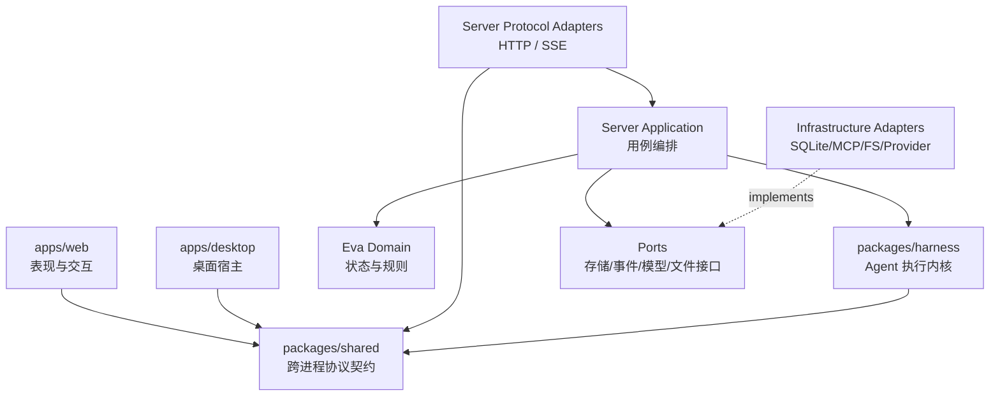
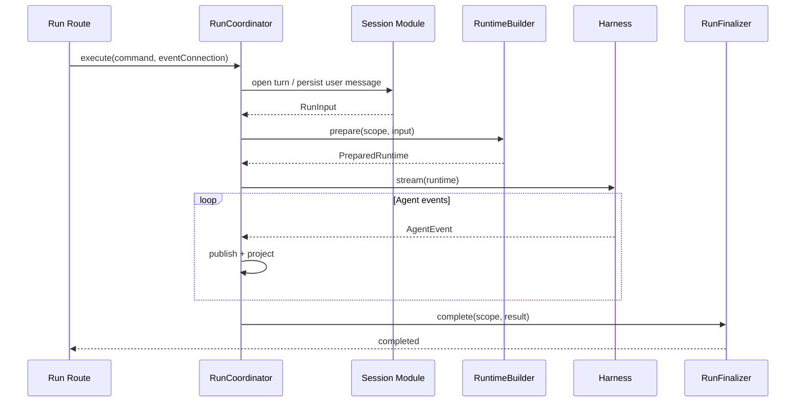

# Eva 简明架构总纲与渐进改造方案

> 状态：Review Draft
>
> 日期：2026-08-30
>
> 适用范围：`apps/server`、`packages/harness`、`packages/shared`、`apps/web`、`apps/desktop`、测试与架构文档
>
> 目的：作为 Eva 下一阶段架构收敛的总纲、模块改造依据，以及交给其他工程师或模型进行二次评审的自包含材料。

---

## 阅读导航

- 只评审总体方向：阅读 0、2、3、5、6、13、16；
- 评审某个具体模块：先读 3 和 6，再读 7 中对应模块；
- 评审可执行性：重点阅读 10、11、12、13；
- 准备开始第一轮改造：阅读 5、7.2、8、11.4、12 的 Wave 0–1；
- 检查是否过度设计：重点阅读 2.2、C6、C7、5.2、5.3。

本文中的“必须/禁止”表示目标架构的强约束；“应/建议”表示默认选择，偏离时需要在 Review 中说明理由；“可以/P3”表示可选优化。本文仍是 Review Draft，描述的是目标与迁移方案，不代表当前代码已经满足全部约束。

---

## 0. 执行摘要

Eva 不需要重写，也不需要替换 Fastify、Electron、React、SQLite 或 Vercel AI SDK。当前架构的基础方向是成立的：桌面壳、内嵌服务、Agent Harness、Shared 契约和 Web 前端已经有清楚的进程边界；真正的问题是随着能力增长，**应用编排、模块所有权、公开边界和当前架构文档没有同步收敛**。

本方案的核心不是“把大文件切成小文件”，而是建立四条长期有效的约束：

1. **协议层只翻译协议，应用层显式编排流程。**
2. **每份状态只有一个所有者和一个事实源。**
3. **跨模块只能通过公开能力协作，不能穿透到对方的 Repository 或内部文件。**
4. **每一次 Run 都能通过统一标识和事件账本还原因果链。**

目标架构采用“**仓库级单向依赖 + Server 内按业务模块垂直切分 + Harness 作为独立执行内核**”。不引入重量级 DDD 框架，不追求为每个类创建接口，也不建设全局 Event Bus。

第一优先级是改造 Run 主链：将当前 HTTP Handler 中的会话准备、模型路由、能力装配、Agent 执行、消息投影、观测和收尾，收敛到 `RunCoordinator` 与 `RunScope`。之后再逐步清除 Route 对数据库的直接访问、拆分 Harness 主循环、收敛前端大型组件和 Electron 主进程。

完成后，一个完全不了解 Eva 的工程师应当能够：

- 在 30 分钟内理解系统由哪些进程和核心模块组成；
- 在 10 分钟内找到一个功能的唯一入口、状态所有者和失败路径；
- 在不超过 5 个核心文件的跳转内读懂“发送一条消息”的主链；
- 仅凭 `runId` 定位一次执行经历了什么、卡在哪里、为何失败；
- 在增加功能时知道应该修改哪里，也知道哪些位置禁止修改。

---

## 1. 背景与当前问题

### 1.1 已经做对的部分

以下基础设计应保留：

- Electron、Server、Web 三个进程/运行时边界清楚；
- `packages/harness` 与 Fastify、React 解耦；
- SQLite 是本地持久化事实源；
- SSE 支持断线后重新挂载，断连不等于中止 Run；
- Run、Message、Approval、Run Event 已经是一等持久化概念；
- `run_events` 作为 append-only 调试账本，而不是依赖普通日志反推事实；
- Agent 以单一工厂入口装配，工具审批、并发帽、执行计时等横切行为已有明确顺序；
- Web 已按 `features/shared` 切分，并对流式渲染做了性能隔离；
- Plan Gate、Plan Weave、Memory、MCP、Subagent 等复杂能力已有独立实现，不需要推倒重建。

因此，本次工作的性质是**架构收敛**，不是架构替换。

### 1.2 当前复杂度热点

以下数字是 2026-08-30 的代码快照，用于说明问题，不作为永久 KPI：

- `apps/server/src/routes/runs.ts` 约 575 行；
- `packages/harness/src/agents/agent.ts` 约 926 行；
- `apps/desktop/electron/main.ts` 约 750 行；
- Server 的 18 个 Route 文件中，约 10 个会直接访问 `app.infra.db` 或创建 Repository；
- Web 中 Sidebar、Memory Settings、Provider Settings、Trajectory View、Message Bubble 等文件达到 300–700 行；
- `docs/architecture` 与 `docs/plans` 合计近百篇、三万余行，研究、历史计划、目标架构和当前事实混在一起。

文件变大本身不是根因。根因是同一个文件同时承担多个“变化原因”。例如一次 Run 的 HTTP Handler 同时知道：

- Fastify 和 SSE；
- Session 与 Workspace；
- Run Registry 与 Run Ledger；
- Provider、Model 与 Skill 选择；
- Memory、MCP、Plan Gate、Plan Weave；
- Approval 与 Plan Review；
- Subagent 与 Report Gateway；
- Observer、Run Recorder 与 Message Recorder；
- 成功、失败、断连、中止与清理。

新增任何能力都容易继续进入这个入口，最终形成“所有功能都能找到，但没有人知道边界在哪里”的局面。

### 1.3 当前问题的四个根因

#### 根因 A：缺少明确的应用用例层

当前存在 Route、Service、Repository，但“完成一次用户动作需要如何编排多个模块”主要写在 Route 里。Route 因此从协议适配器演变为业务总控。

#### 根因 B：模块边界是目录约定，不是可执行约束

设计上希望依赖是 `routes -> services -> repositories`，但 Route 可以直接访问 DB，模块也可以导入其他模块的内部文件。目录表达了意图，编译器和 CI 没有执行这个意图。

#### 根因 C：运行期状态很多，但所有权没有统一表达

Run Registry、Run Ledger、Run Hub、Message Recorder、Approval Gateway、Run Event Recorder 都是合理概念，但如果不明确哪一个回答哪类问题，阅读者会误以为它们是重复状态，修改者也容易从错误的投影反推业务事实。

#### 根因 D：文档没有区分当前事实、设计决策和历史研究

当前文档既记录外部产品研究，又记录 Eva 的目标架构、旧计划和已实现状态。新读者首先需要做文档考古，才能判断代码为什么是现在这样。

---

## 2. 目标与非目标

### 2.1 目标

#### G1：结构简单清晰

- 顶层目录能表达系统的主要能力；
- 每个业务能力有唯一入口；
- 主控制流是显式函数调用，不靠隐式事件链拼接；
- 读者可以从入口向内单向阅读，不需要来回跳层。

#### G2：模块低耦合

- 每个模块拥有自己的状态和不变量；
- 跨模块只依赖公开 API 或 Port；
- 基础设施可以替换，业务规则无需修改；
- 删除一个可选能力时，不需要修改整个 Run 生命周期。

#### G3：便于 Debug

- 每次 Run 有完整因果标识；
- 每个阶段有结构化开始、结束、耗时和错误；
- 产品状态、调试事实、普通日志和 UI 投影严格区分；
- 可从一个 `runId` 还原模型、工具、审批、子代理和持久化过程。

#### G4：便于人类阅读

- 主路径最多跨越约 5 个核心文件；
- 文件名表达业务责任，不使用模糊的 `utils/manager/processor`；
- 注释解释不变量和原因，不依赖历史任务编号；
- 当前架构入口文档不超过少量自包含文档。

### 2.2 非目标

本方案明确不做：

- 不一次性重写整个仓库；
- 不更换现有主要技术栈；
- 不为了“纯粹”把每个函数都包装成 Service 或 Interface；
- 不引入全局 Event Bus 代替显式控制流；
- 不为了缩短文件而制造大量只有几十行、命名含糊的中转文件；
- 不把所有模块强行做成可动态加载的插件；
- 不在架构重构期间同时改变核心产品语义；
- 不用行数作为唯一质量指标；
- 不把 Shared 变成所有层都可以随意塞类型的垃圾场。

---

## 3. 设计原则：Eva 架构宪法

以下条款是规范性要求。后续实现和 Review 应以这些条款为准。

### C1：依赖只能朝稳定方向流动

外层可以依赖内层，内层不能反向认识外层：



仓库级允许的编译依赖：

| 来源 | 允许依赖 | 禁止依赖 |
|---|---|---|
| `apps/web` | `@eva/shared`、Web 内部模块 | `apps/server`、`@eva/harness`、数据库 |
| `apps/desktop` | 桌面内部模块、必要的 Shared 契约 | Server 内部 Service、Harness 内部实现 |
| `apps/server` | `@eva/harness`、`@eva/shared` | Web、Desktop |
| `packages/harness` | `@eva/shared`、AI SDK | Fastify、Drizzle、Eva DB、React、Electron |
| `packages/shared` | 极少量纯协议依赖 | Server、Harness、Web、Node 平台实现 |

### C2：协议层只翻译协议

HTTP/SSE Route 只能做：

1. 请求解析和 Zod 校验；
2. 调用一个应用用例；
3. 将领域错误映射为 HTTP 状态码；
4. 将应用事件编码成 SSE；
5. 处理连接建立与断开。

Route 禁止：

- 直接访问 DB；
- `new XxxRepository()`；
- 组装 Agent；
- 决定审批策略；
- 构造 Plan/Memory/Subagent Runtime；
- 修改多个模块的状态；
- 包含产品级事务流程。

### C3：应用层显式编排用例

应用层回答：

> 完成一个用户动作，需要按照什么顺序调用哪些能力？

典型应用用例包括：

- `StartRun` / `RunCoordinator.execute`；
- `AbortRun`；
- `AttachRunStream`；
- `RetryMessage`；
- `ApproveToolCall`；
- `CompactThread`；
- `CreatePlan` / `ReviewPlan`；
- `UpdateProvider`；
- `SearchThreads`。

应用层可以依赖领域规则和 Port，但不能依赖 Fastify Reply、SQL 查询细节或 React 状态。

### C4：每份状态只有一个所有者

每个模块必须说明：

- 拥有哪些表、文件或内存状态；
- 维护哪些不变量；
- 哪些操作可以修改状态；
- 哪些状态是事实，哪些只是投影；
- 谁可以读取，谁可以写入。

禁止模块 A 直接修改模块 B 拥有的表。跨模块写入必须调用 B 的公开命令。

### C5：能推导的状态不重复存储

如果一个字段可以可靠地从其他事实推导，就优先使用纯函数推导，而不是维护第二份可变状态。

允许冗余的情况只有：

- 明确的查询性能需要；
- 持久化当时的历史快照；
- 跨进程协议需要；
- 经过文档记录，并定义了更新者和修复策略。

例如：

- Session 展示状态应从运行中 Run、待审批请求和活跃后台任务推导；
- SSE 是投影，不是 Run 状态事实源；
- `search_text` 是 Message 的可重建索引投影；
- Run 当时使用的模型和 capture level 是历史快照，应持久化。

### C6：只在变化边界使用 Port

Port 适用于：

- 数据库存储；
- 文件系统；
- 时钟与 UUID；
- 模型供应商；
- MCP；
- Event Sink；
- Harness 与 Eva Server 的边界。

不要为每个只有一个实现的纯业务类创建 `IXxxService`。接口的价值是隔离变化、支持替换和测试，不是提高抽象数量。

### C7：控制流用直接调用，旁路投影用事件

必须立刻成功、失败会改变主流程的行为使用显式调用：

```text
open session -> resolve runtime -> execute agent -> persist message -> settle run
```

同一事实发生后，多个消费者独立处理的旁路行为可以使用事件：

```text
tool_call_completed
  -> observability append
  -> SSE projection
  -> UI message projection
  -> usage projection
```

禁止用全局事件总线隐藏核心业务顺序。关键持久化不能只依赖“希望某个订阅者稍后处理”。

### C8：具体实现只能在组合根装配

除组合根和模块内部的 Adapter 外，禁止创建 Repository、Provider Client、MCP Client 等具体基础设施对象。

组合根必须是回答以下问题的唯一位置：

> Eva 运行时到底由哪些具体实现组成？

### C9：每个模块只有一个公开入口

跨模块只能从目标模块的 `index.ts` 或明确的 package subpath 导入。

模块的内部文件默认私有。禁止为了方便直接导入另一个模块的 `internal`、Repository 或临时 Helper。

### C10：生命周期资源必须由 Scope 管理

具有一次 Run 生命周期的资源，应集中进入 `RunScope`：

- `runId` / `sessionId`；
- AbortController；
- Run Hub；
- Run Recorder；
- failure layer；
- Plan Gate State；
- Report Gateway；
- 清理函数集合。

`RunScope.dispose()` 必须幂等，并统一完成取消 pending approval、释放 report gateway、注销 registry、关闭订阅者等工作。

### C11：错误必须结构化

跨层错误至少包含：

```ts
interface EvaFailure {
  code: string;
  layer:
    | "routing"
    | "context"
    | "model"
    | "tool"
    | "persistence"
    | "orchestration"
    | "transport";
  operation: string;
  retryable: boolean;
  userMessage: string;
  cause?: unknown;
}
```

用户看到 `userMessage`，HTTP Adapter 根据 `code` 映射状态码，调试账本记录 `layer/operation/cause`。禁止通过匹配错误字符串决定业务行为。

### C12：注释解释不变量，不记录施工历史

代码注释应解释：

- 为什么顺序不能改变；
- 为什么这份状态必须共享；
- 删除约束会产生什么故障；
- 哪个稳定 ADR 记录了设计决定。

`T44`、`T48`、`S7` 等历史任务号不应成为理解代码的前置条件。任务历史保留在 Plan 或 Git 中，稳定决策进入 ADR。

---

## 4. 目标目录结构

### 4.1 总体原则

采用“仓库按运行时分包，Server 内按业务能力垂直切分”。

不要求一次性迁移到以下结构。它描述的是最终稳定形态，新模块直接遵守，旧模块逐步靠拢。

```text
apps/
  desktop/                    # Electron 宿主
  server/
    src/
      bootstrap/              # 启动、组合根、生命周期
      platform/               # DB、config、crypto、logging、path
      modules/
        runs/
        sessions/
        approvals/
        providers/
        settings/
        memory/
        workspaces/
        plan-gate/
        plan-weave/
        subagents/
        mcp/
        observability/
        search/
        usage/
      transports/             # HTTP/SSE 通用传输代码
  web/                        # React 表现层

packages/
  harness/                    # Agent 执行内核
  shared/                     # 跨进程协议契约
```

### 4.2 业务模块内部结构

小模块保持扁平，不要预先创建五层空目录：

```text
modules/approvals/
  approval-service.ts
  approval-policy.ts
  approval-store.ts           # Port
  drizzle-approval-store.ts   # Adapter
  approval-routes.ts          # HTTP Adapter
  index.ts                    # Public API
```

只有当文件数和职责明显增长后，再在模块内部创建：

```text
modules/runs/
  application/
  domain/
  adapters/
  index.ts
```

这条规则避免“为了架构图好看，实际阅读要穿过大量目录”。

### 4.3 技术共享代码的进入条件

一个实现只有同时满足以下条件，才可以进入 `platform` 或 `shared`：

1. 至少被三个业务模块真实使用；
2. 没有明显业务所有者；
3. 名称能准确描述职责；
4. API 比复制少量代码更稳定；
5. 不会让调用方绕过模块边界。

禁止新增笼统的 `utils.ts`、`helpers.ts`、`common.ts` 作为临时收纳箱。

---

## 5. 核心 Run 生命周期

### 5.1 目标主链

一次 Run 固定经过五个应用阶段：



五个阶段及其责任：

| 阶段 | 责任 | 明确不做 |
|---|---|---|
| Open | 会话互斥、创建/重试消息、绑定 Workspace、创建 Run 事实 | 不解析模型、不装 Agent |
| Prepare | 解析模型、选择 Skill、准备 Memory/Plan/MCP、构造 Agent Runtime | 不开启 SSE、不落 assistant 终态 |
| Execute | 驱动 Harness、发布事件、更新消息投影 | 不决定 HTTP 错误码 |
| Complete | 完成 assistant message、usage、Run 终态、end frame | 不重复执行业务准备 |
| Fail/Dispose | 结构化失败、必要回滚、取消 pending、释放资源 | 不吞掉原始 cause |

### 5.2 RunCoordinator 不应成为新 God Object

`RunCoordinator` 只保留五阶段骨架，把细节委托给具名协作者：

```ts
class RunCoordinator {
  constructor(
    private readonly opener: RunOpener,
    private readonly runtimeBuilder: RunRuntimeBuilder,
    private readonly executor: RunExecutor,
    private readonly finalizer: RunFinalizer,
  ) {}
}
```

优先使用普通对象和函数，不要求每个协作者都是 Class。

### 5.3 能力装配保持显式

初期不要引入通用 `RunPlugin` 或任意生命周期 Hook。`RunRuntimeBuilder` 应显式列出当前能力：

```ts
const skills = await skillRuntime.prepare(context);
const memory = await memoryRuntime.prepare(context);
const plans = await planRuntime.prepare(context);
const mcpTools = await mcpRuntime.tools(context);
const subagents = subagentRuntime.prepare(context);

return agentFactory.build({
  tools: [...memory.tools, ...plans.tools, ...mcpTools, ...subagents.tools],
  promptSections: [...skills.sections, ...memory.sections, ...plans.sections],
});
```

显式代码比抽象 Hook 更容易阅读和 Debug。只有未来至少三个独立能力反复呈现完全相同、稳定的装配协议时，才考虑提取 `RuntimeContribution`。

---

## 6. 状态所有权与事实源

| 领域 | 唯一事实源 | 内存状态/投影 | 唯一写入者 |
|---|---|---|---|
| Session 基本信息 | `sessions` | Sidebar 查询结果 | Session Module |
| 消息与分支 | `messages.message` + parent/slot/depth | Streaming message builder | Session/Message Module |
| Run 持久化终态 | `runs` | 当前请求的 `RunScope` | Runs Module |
| Run 是否在本进程可控制 | `RunRegistry` | UI running 状态 | Runs Module |
| Run 调试事实 | `run_events` | Trajectory projection | Observability Module |
| 审批决定 | `approval_requests` | pending deferred promise、审批卡片 | Approval Module |
| Approval policy | `settings.security.allowAlwaysPolicies` | 进程内 key set | Approval Module，经 Settings Module 写回 |
| Provider 配置 | `providers` | LanguageModel cache | Provider Module |
| 应用设置 | `settings` | 每 Run 设置快照 | Settings Module |
| Skill Catalog | 已加载的 `SKILL.md` 文件集合 | 当前进程 catalog | Skills Module |
| Session Skill 选择 | `session_skill_selections` | 每 Run selection snapshot | Skills Module |
| Memory 搜索事实 | `memories` + embeddings/FTS | recall context | Memory Module |
| 人类可读 Memory | `~/.eva/MEMORY.md`、daily files | prompt section | Memory Module |
| Workspace | `workspaces` | 当前 Session 绑定结果 | Workspace Module |
| Plan Gate | `plans` + workspace gate file | run-scoped gate state | Plan Gate Module |
| Plan Weave | workspace `.eva/plan-weave` | ready 推导、锁内快照 | Plan Weave Module |
| 后台子代理任务状态 | `background_tasks` | live runner | Subagent Module；child message/run 仍由各自模块写入 |
| MCP Server 配置 | `mcp_servers` | live connections + tool definitions | MCP Module |
| Usage | `usage_records` / Run usage 快照 | UI 聚合 | Usage Module |
| SSE | 无持久化权威 | Run Hub replay buffer | Transport projection only |

规则：

- 读取其他模块的数据优先调用 Query API；
- 写其他模块的数据必须调用 Command API；
- 为性能建立的投影必须可从事实源重建；
- 所有缓存必须有明确失效入口；
- 进程崩溃后无法恢复的内存状态，不能作为业务终态依据。

---

## 7. 模块改造方案

本节描述每个现有模块的目标职责和渐进改造动作。优先级：

- **P0**：阻断复杂度继续增长；
- **P1**：核心主链收敛；
- **P2**：阅读性和边界完善；
- **P3**：可选优化。

### 7.1 Bootstrap、Infrastructure 与 Service Assembly

#### 当前问题

- `deps.ts`、`services/index.ts` 和 Fastify `app.infra/app.services` 只装配了一部分能力；
- Route 仍能拿到原始 DB、config、encryptor，并自行创建 Repository；
- `AppServices` 暴露的是具体类集合，不是面向用例的公开能力。

#### 目标职责

- `bootstrap` 负责进程启动、迁移、stale sweep、retention、静态资源和生命周期；
- `composition-root` 负责创建所有具体 Store、Adapter、Module API 和 Use Case；
- Route 只拿到应用用例与 Query API，不拿原始 DB；
- `platform` 提供 config、db、crypto、logger、path 等技术实现。

#### 改造动作

1. **P0**：规定新 Route 不得访问 `app.infra.db`；
2. **P1**：新增 `AppApi`，按业务模块暴露 `runs/sessions/approvals/...`；
3. **P1**：将全部 Repository 创建移动到组合根或所属模块内部；
4. **P2**：Route 不再直接获得 `encryptor`、Repository 和可变 Runtime Registry；
5. **P2**：将启动清扫与请求期装配分离，避免 `deps.ts` 继续膨胀；
6. **P3**：为组合根增加 smoke test，验证关键服务只实例化一次、依赖无环。

### 7.2 Runs

#### 当前问题

`routes/runs.ts` 是当前最大应用编排热点。审批闭包、Plan Review、Observer、MCP、Skill、Plan、Subagent、Message Recorder 和清理逻辑都在 HTTP Handler 中。

#### 目标职责

Runs 模块拥有：

- Run 生命周期；
- Run Scope；
- Live Run Registry/Hub；
- Run 持久化状态；
- Start、Attach、Abort 三个应用用例；
- Agent Event 到产品事件的主投影顺序。

#### 建议结构

```text
modules/runs/
  run-routes.ts
  run-coordinator.ts
  run-scope.ts
  run-opener.ts
  run-runtime-builder.ts
  run-executor.ts
  run-finalizer.ts
  run-registry.ts
  run-hub.ts
  run-store.ts
  drizzle-run-store.ts
  index.ts
```

不要求一次创建所有文件。先提取 `RunScope`、`RunCoordinator` 和 `RunFinalizer` 即可。

#### 改造动作

1. **P0**：补齐 Start/Retry/Abort/Disconnect/Approval pending/Agent error 的 characterization tests；
2. **P1**：提取 `RunScope`，统一持有 run-scoped 资源和幂等清理；
3. **P1**：提取 `RunApprovalChannel`，移出 Route 中的审批与 Plan Review 闭包；
4. **P1**：提取 `RunRuntimeBuilder`，显式装配 Skill、Memory、Plan、MCP、Subagent；
5. **P1**：提取 `RunFinalizer`，统一完成 settle/fail/rollback/end/cleanup；
6. **P1**：Route 收敛为 schema、connection、use case、error mapping；
7. **P2**：将 `runPhase` 替换为显式状态转换；
8. **P2**：为 `RunScope.dispose` 添加幂等、部分初始化和异常清理测试；
9. **P3**：如果 Run Hub 与 Registry 始终同寿，可将 Hub 作为 Registry entry 的内部细节，减少公开概念。

### 7.3 Sessions、Messages 与 Message Tree

#### 当前问题

- Session CRUD、Message 记录、分支树、状态、用量、compact 入口分散；
- `routes/threads.ts` 承担多类 Query 和 Command；
- Route 直接创建 Session/Message/Run/BackgroundTask Repository。

#### 目标职责

Sessions 模块拥有：

- Session 元数据；
- Message 树及 active leaf；
- 新建、继续、重试、删除和重命名；
- 构建模型历史；
- Session 状态纯推导；
- Session 查询视图。

Usage、Compact、Search 作为独立模块通过 Session Query API 读取，不直接更新 Session 内部表。

#### 改造动作

1. **P1**：把 Thread Route 拆成命令用例和查询用例，不按 HTTP 端点堆在一个文件；
2. **P1**：将 active leaf、retry、version branch 不变量集中到 Message Tree 领域代码；
3. **P1**：禁止 Run Preparation 自行创建 Session/Message Repository，改依赖 Session API；
4. **P2**：定义 `SessionReader` 与 `SessionWriter`，Query 不获得写能力；
5. **P2**：将 `session-status.ts` 保持为纯投影并补状态优先级测试；
6. **P2**：为 Message JSON、search text、branch metadata 明确事实与派生关系；
7. **P3**：根据查询量考虑独立 `ThreadViewRepository`，但不让它成为第二份写模型。

### 7.4 Approvals 与 Security Policy

#### 当前问题

- Approval Gateway、Policy Store、HTTP Route、Run 闭包和 Harness wrapper 跨越多层；
- 普通审批与 Plan Review 共享持久化但具有不同协议；
- 自动批准原因、policy 命中、SSE 投影由 Run Route 拼接。

#### 目标职责

Approval 模块拥有：

- pending request 与 deferred promise；
- 普通审批和 Plan Review 的创建、决策、取消；
- policy match/grant；
- 自动批准原因；
- 决策事实查询。

Harness 只认识 `RequestApproval` / `RequestPlanReview` Port，不认识数据库和 SSE。

#### 改造动作

1. **P1**：新增 `RunApprovalChannel`，把业务策略与 SSE 事件组合封装在 Server 应用层；
2. **P1**：普通审批与 Plan Review 使用显式不同的命令类型，避免 boolean 协议扩张；
3. **P1**：统一 `cancelByRun` 的终态语义和幂等性；
4. **P2**：将 readonly-safe、plan-file、policy-hit 的判定写成可独立测试的决策链；
5. **P2**：Route 仅调用 `decideApproval` / `decidePlanReview` 用例；
6. **P2**：在持久化层约束每个 callId 只能完成一次合法决策。

### 7.5 Providers、Models 与 Settings

#### 当前问题

- Provider HTTP、Repository、Model Resolver、Settings、Agent Factory 的缓存失效彼此耦合；
- Provider Route 直接操作 Repository，并手动调用 `agents.invalidate()`；
- 配置变更副作用依赖调用方记得执行。

#### 目标职责

- Provider 模块拥有 provider 配置、apiKey 加密边界、模型发现；
- Settings 模块拥有应用设置；
- Model Routing 读取 Provider + Settings，输出不可变的 Run Routing Snapshot；
- Provider/Settings 更新用例负责验证、持久化和触发缓存失效；
- Route 不直接触碰加密器或 Agent cache。

#### 改造动作

1. **P1**：把 create/update/delete/discover provider 收敛为 Provider Commands；
2. **P1**：缓存失效成为 Provider/Settings Command 的内部后置动作；
3. **P1**：`AgentFactory.resolveModels` 只消费 Model Routing API，不直接读取 DB；
4. **P2**：把 `provider-repository.ts` 中的 SQL 与 provider 业务校验分开；
5. **P2**：保存 Run 级 `RoutingSnapshot`，明确 requested/resolved/tool model；
6. **P2**：Settings Route 只调用 `getSettings` / `replaceSettings`；
7. **P3**：为 Provider 探活和模型发现定义统一、可超时的 Client Port。

### 7.6 Agent Factory 与 Runtime Builder

#### 当前问题

`AgentFactory` 同时承担模型解析、模型实例缓存、主 Agent 工具装配、Prompt 组装、Plan Gate 注入和 Subagent 构建。

#### 目标职责

- `ModelRegistry`：LanguageModel 实例缓存；
- `ModelRouter`：解析 chat/tool/embedding 等槽位；
- `ToolCatalogBuilder`：构造某个 Runtime 可用的基础工具；
- `PromptComposer`：从显式 sections 组装 prompt；
- `AgentFactory`：消费已经准备好的模型、工具、prompt 和策略，创建 Harness Agent；
- `RunRuntimeBuilder`：Eva 应用层能力装配总入口。

#### 改造动作

1. **P1**：先把 Eva 业务装配移到 `RunRuntimeBuilder`，不要立即拆所有 Factory；
2. **P2**：将模型解析和模型实例缓存从 Agent 构造职责中分离；
3. **P2**：让 Agent Factory 的输入成为明确的 `PreparedAgentRuntime`；
4. **P2**：主 Agent 与 Subagent 共享模型/工具基础构造，不共享业务生命周期；
5. **P3**：根据实际复用再决定是否把 Tool Catalog 独立成模块，避免提前抽象。

### 7.7 Skills

#### 当前问题

- Harness 负责 Skill 解析、加载、自动选择、Prompt 和 `read_skill` 工具；
- Server 负责从安装目录加载 Skill、记录 Session 累积选择，并在 Run 前调用 tool model；
- Skill Route 直接读取 `app.infra.skills`；
- `always-inject`、`allowed-tools`、Session 累积选择和本轮新选择的关系需要读实现才能完全理解。

#### 目标职责

Harness Skills：

- 定义 `SKILL.md` 格式和校验；
- 提供 Skill Catalog 的纯解析结果；
- 提供自动选择算法、Prompt section 和 `read_skill` 工具；
- 不知道 Eva Session 表和安装目录策略。

Server Skills：

- 拥有当前安装的 Skill Catalog；
- 拥有 `session_skill_selections`；
- 将 always-inject、历史累积和本轮新选择合并为不可变 Run Snapshot；
- 向 Run Runtime 返回 selected skills、prompt contribution 和 preferred tools。

#### 改造动作

1. **P1**：建立 `SkillCatalog` 公开 Query API，Skill Route 不再读取 `app.infra.skills`；
2. **P1**：`selectRunSkills` 依赖 Selection Store Port 和 Model Selector Port，不直接创建 Repository；
3. **P1**：Run Runtime 保存 selected skill names、allowed tools 和 fallback 结果快照；
4. **P2**：把 always-inject、Session 累积、本轮新选的合并规则提取为纯函数；
5. **P2**：明确 `allowed-tools` 只是 preferred tools contribution，不是整个工具集的替代；
6. **P2**：Catalog 对无效 Skill 的跳过和 warning 保持可观测；
7. **P3**：为 Skill 来源、版本/hash 和重新加载策略建立稳定契约。

### 7.8 Memory 与 Compact

#### 当前问题

- Memory 有 DB、Embedding、FTS、Memory Files、Recall、Prompt、Tools 多种形态；
- Compact 与 Memory 都参与上下文构造，容易被误认为一个模块；
- Route 存在直接 DB 聚合和后台 embedding 调用。

#### 目标职责

Memory 模块拥有：

- DB memory 与 embedding 状态；
- 人类可读 memory files；
- recall query；
- Memory Tools；
- Memory Prompt Contribution。

Compact 模块拥有：

- Session 历史压缩；
- proactive compact 配置；
- summary 生成；
- compaction 记录。

二者在 Run Prepare 阶段协作，但互不拥有对方状态。

#### 改造动作

1. **P1**：Memory Route 改为 Query/Command API，移除直接 SQL 聚合；
2. **P1**：定义单一 `MemoryRuntimeContribution` 返回 tools + context + prompt sections；
3. **P1**：Compact 只通过 Session API 获取历史与提交摘要；
4. **P2**：Embedding 后台失败结构化记录，不用空 catch 吞掉；
5. **P2**：明确 DB Memory 与 File Memory 的写入路由规则及测试；
6. **P2**：把 token estimation 的所有者定为 Context/Compact 支撑能力，避免多处实现；
7. **P3**：为 recall 建立可解释结果，包括命中来源、得分和是否注入。

### 7.9 Workspaces 与 Filesystem

#### 当前问题

- Workspace DB、目录选择、路径守卫、项目文档加载分散；
- Harness FS Tools 与 Server Workspace 共同维护路径安全语义；
- Workspace Context 在 Run Prepare 和 Agent Factory 间传递多个衍生字段。

#### 目标职责

- Workspace 模块拥有 workspace 注册、绑定和路径合法性；
- Harness FS Tools 只接受经过 Server 解析的 `WorkspaceRoot`；
- 路径解析与写守卫仍在 Harness 执行边界兜底；
- 项目文档是 Workspace 对 Run Runtime 的 contribution。

#### 改造动作

1. **P1**：所有 workspace command/query 通过 Workspace API；
2. **P1**：建立不可随意构造的 `ValidatedWorkspace` 数据形态；
3. **P2**：Server 负责选择和验证 root，Harness 负责每次工具调用的相对路径约束；
4. **P2**：统一 project docs 的读取、大小限制和来源说明；
5. **P2**：Directory Picker 明确为 OS Interaction Adapter：Electron IPC 优先、local server 原生命令为回退，均不进入 Workspace 领域规则；
6. **P3**：增加 workspace path symlink、deleted root、permission change 的契约测试。

### 7.10 Plan Gate 与 Plan Weave

#### 当前问题

两者名字接近，但语义不同：

- Plan Gate 是 Session/Run 级审批闸门；
- Plan Weave 是 Workspace 级文件任务图。

它们目前会在 Run Route、Server Service、Harness Tools 三处同时出现，阅读者容易把它们看成一个系统。

#### 目标职责

- 保持两个独立模块和独立事实源；
- 在命名和文档中始终使用 `PlanGate` 与 `PlanWeave` 全称；
- 只在 `RunRuntimeBuilder` 汇合；
- Harness 仅包含状态守卫和工具 Port，不知道 DB/workspace service。

#### 改造动作

1. **P0**：写模块 README 明确两者差异、作用域和事实源；
2. **P1**：Plan Gate runtime 构建移出 Run Route；
3. **P1**：Plan Weave tools 由明确的 server gateway 绑定 workspaceId/runId；
4. **P2**：Route 不直接构建 Plan Repository 或 file store；
5. **P2**：两套状态机分别保持纯规则测试；
6. **P2**：在产品层 Review 两个能力是否都仍然必要；若都保留，不因代码复用强行合并；
7. **P3**：只有出现稳定共同协议时才抽取共同的 Plan Runtime 类型。

### 7.11 Subagents

#### 当前问题

- Harness 包含通用 fork/crew/task 原语；
- Server 包含任务持久化、消息记录、子 Run recorder 和 report gateway；
- Run Route 负责拼装前台/后台 Observer、Approval 和 SSE 回报。

#### 目标职责

Harness Subagent：

- 角色、深度、delegate 限制；
- fork primitive；
- task/result 协议；
- 与 Eva 持久化无关。

Server Subagent：

- background task 与 child run 所有权；
- transcript/message 持久化；
- observer 绑定；
- report/notice 注入；
- abort 和终态策略。

#### 改造动作

1. **P1**：提取 `SubagentRuntimeFactory`，从 Run Route 接管全部子代理装配；
2. **P1**：前台与后台子代理的 Run/Recorder 所有权写成显式策略；
3. **P1**：所有 task 状态转换经单一 Task Store API；
4. **P2**：统一 parentRunId/backgroundTaskId/parentToolCallId 关联规则；
5. **P2**：明确主 Run abort 对前台和后台子代理的产品语义，并用测试固定；
6. **P2**：Report Gateway 生命周期进入 RunScope；
7. **P3**：删除 Harness 中不再被真实运行时使用的旧 scaffold，防止出现两个子代理入口。

### 7.12 MCP

#### 当前问题

- 配置文件导入、DB、Client、Registry、Tool 转换和 Route 集中在同一技术区域；
- Route 自行创建 Repository，同时调用 Registry reconnect；
- 配置更新和 live connection 更新不是一个封装好的应用命令。

#### 目标职责

- DB 是 MCP Server 配置事实源；
- config file 是导入 Adapter；
- Registry 是 live connection 投影；
- MCP Commands 负责“持久化成功后更新 live runtime”；
- Run Runtime 只从 MCP Query API 获取当前工具快照。

#### 改造动作

1. **P1**：建立 create/update/delete/reconnect MCP 应用用例；
2. **P1**：Route 不再创建 McpServerRepository；
3. **P1**：定义配置更新与 live reconnect 的失败语义；
4. **P2**：MCP Client 与 Registry 通过 Port 隔离；
5. **P2**：Run 获取不可变 Tool Snapshot，避免一次 Run 中工具集被中途改变；
6. **P2**：MCP 错误保持降级，不让单个 Server 破坏主 Run；
7. **P3**：为动态工具 schema 和 readOnly hint 建契约测试。

### 7.13 Observability 与 Trajectory

#### 当前问题

- Run Recorder、Observer Bridge、redact、canonical、retention、sweep 已较完整；
- Run Route 仍负责创建和绑定 recorder；
- Trajectory Route 直接创建多种 Repository；
- Web Trajectory 的纯投影和 UI 文件较大。

#### 目标职责

- `run_events` 是唯一 canonical debug ledger；
- Observer Bridge 是 Harness Event 到 Eva Ledger Event 的适配器；
- RunScope 持有当前 Run recorder；
- Trajectory Query Service 提供分页、线程聚合和导出；
- Web 只做纯投影、折叠和展示。

#### 改造动作

1. **P1**：Recorder 创建进入 RunScope Factory；
2. **P1**：Trajectory Route 改依赖 Query Service；
3. **P1**：统一事件 envelope 和 correlation identifiers；
4. **P2**：为所有 operation start/end/abandoned 建配对不变量测试；
5. **P2**：保留 `derive-trajectory` 纯函数属性，按事件族拆分投影器；
6. **P2**：把 Web Overview、Ledger、Inspector 的数据投影与 UI 组件进一步分离；
7. **P3**：提供脱敏的 Run Debug Bundle 导出，包含 routing/tool/approval/timing 摘要。

### 7.14 Search 与 Usage

#### 当前问题

- Search 和 Usage Route 直接做 SQL/Repository 聚合；
- 查询逻辑与 HTTP 参数解析混合；
- 它们本质上是只读投影模块，不应获得主业务写能力。

#### 目标职责

- Search Query Service 读取 Session/Message Search Projection；
- Usage Query Service 读取 usage records 和 run usage；
- Route 只解析查询条件；
- 查询模型可以为性能使用专用 Read Repository，但不能修改事实源。

#### 改造动作

1. **P2**：提取 Search Query Service；
2. **P2**：提取 Usage Query Service；
3. **P2**：将聚合 SQL 移入 Read Repository；
4. **P2**：为分页、排序、日期边界和空数据库建立测试；
5. **P3**：如果查询模型增长，明确使用 CQRS-lite，只分读写 API，不引入消息中间件。

### 7.15 Database 与 Schema

#### 当前问题

- 单个 schema 文件承载所有领域表；
- Repository 在 DB 目录集中，但调用方可以绕过模块 API；
- 时间格式存在 epoch ms 与 ISO text 两种，需要靠注释理解。

#### 目标职责

- SQLite 仍为单库，不按模块拆数据库；
- Schema 可以按领域拆文件，在 DB index 汇总；
- 每张表有明确模块所有者；
- 跨表查询进入 Read Repository；
- 写入仍由拥有该表的模块执行。

#### 改造动作

1. **P1**：建立“表 -> 模块所有者”清单；
2. **P2**：根据领域拆分 schema 文件，但不改变 migration 语义；
3. **P2**：禁止 Route 直接导入 schema 或 DB；
4. **P2**：为时间单位定义具名类型/转换函数，不在调用处猜；
5. **P2**：跨模块事务由应用用例协调，事务句柄通过窄 Port 传入；
6. **P3**：Repository 命名统一为 Store 或 Repository，选定一种后逐步收敛，不同时混用多个同义词。

### 7.16 `packages/harness`

#### 当前问题

Agent 主文件同时承担 loop、recovery、abort compensation、finish、telemetry 和 tool pipeline 装配；根 `index.ts` 广泛 `export *`，公共面大于实际需要。

#### 目标职责

Harness 是可独立测试的 Agent 执行内核：

```text
harness/src/
  agent/
    agent.ts               # 小型 façade
    run-loop.ts            # SDK step loop
    recovery-policy.ts     # compact/max-output/notice
    finish-run.ts          # finish/abort 汇总
    types.ts
  tools/
    tool-pipeline.ts       # gate -> approval -> cap -> timing
    catalog/
  context/
  models/
  prompts/
  skills/
  subagents/
  public.ts
```

目录名可以沿用现状，重点是职责边界而非改名。

#### 改造动作

1. **P0**：在拆分前为 reactive compact、max-output、notice、abort 补偿建立行为测试；
2. **P1**：提取 `buildToolPipeline()`，测试 wrapper 顺序和 timing 归属；
3. **P1**：提取 recovery policy，主 loop 只负责阶段推进；
4. **P1**：提取 finish/abort 汇总，保证所有终态事件顺序唯一；
5. **P2**：`agent.ts` 收敛为 façade 和主控制骨架；
6. **P2**：公开 API 改为显式 export，避免默认暴露内部 mapper/helper；
7. **P2**：models 只包装 AI SDK provider，不读取 Eva Settings；
8. **P2**：Memory、Plan 等工具只依赖 Port，不依赖 Eva Server 实现；
9. **P3**：评估 `approval/policy-key` 是否属于 Eva 产品规则；若与 Harness 无关，应上移 Server Approval 模块。

### 7.17 `packages/shared`

#### 当前问题

- 同时承载 SSE、UI Message、Replay、MCP 和大量 API 类型；
- 单根入口使 Web/Server 容易无意依赖过大的公共面；
- 有变成跨层通用类型收纳箱的风险。

#### 目标职责

Shared 只保存**跨进程、跨 package 的线协议契约**：

- HTTP DTO；
- SSE event schema；
- UI Message wire shape；
- 可跨端复用的纯序列化 helper。

不放入：

- DB row 类型；
- Repository 接口；
- Server 领域对象；
- Harness 内部状态；
- React component props；
- Node/Electron 实现。

#### 改造动作

1. **P1**：为 Shared 建立“必须跨边界才进入”的 Review 规则；
2. **P2**：按 `stream-events`、`messages`、`mcp` 等提供 package subpath export；
3. **P2**：减少根入口 `export *`，显式列出稳定契约；
4. **P2**：协议类型优先配套 runtime schema 或解析器；
5. **P3**：给协议增加兼容性测试，防止 Server 与 Web 无感漂移。

### 7.18 Web：Threads 与 Streaming

#### 当前问题

- `useChat` 同时管理请求、session、stream、message commit、retry、abort、attach；
- Chat Page、Sidebar、Message Bubble、Tool Call Block 承担过多 UI 和业务投影；
- API 类型、Server 状态和 UI 状态边界不总是清楚。

#### 目标职责

- API Client：纯 HTTP/SSE；
- Run Controller Hook：启动、重连、中止 Run；
- Thread Store/Reducer：committed 与 streaming projection；
- Components：只渲染 props 和发出用户 intent；
- Feature Query Hooks：React Query 管理服务端状态；
- 临时 UI 状态留在组件附近。

#### 改造动作

1. **P1**：保持 `committed` 与 `streaming` 分离的性能设计；
2. **P2**：将 `useChat` 拆为 `useRunController`、`useThreadMessages` 和组合 hook；
3. **P2**：`run-stream-client` 只做协议解析，不更新 React 状态；
4. **P2**：Sidebar 拆为数据 controller、列表投影和纯展示组件；
5. **P2**：Message Bubble 按 part renderer registry 拆分，但 registry 保持显式；
6. **P2**：Tool/Approval/Plan/Subagent 卡片只消费稳定 ViewModel；
7. **P3**：为 streaming reducer 建事件序列测试，避免刷新/重连导致重复消息。

### 7.19 Web：Settings、Trajectory 与 Workspaces

#### 当前问题

- Memory Settings、Provider Settings、MCP Settings 文件较大；
- 表单、请求、校验、列表和弹窗在同一组件；
- Trajectory 的复杂度来自事件投影、虚拟化、Overview 和 Inspector 多种职责。

#### 目标职责

- 每个 Settings 页面分为 Query Hook、Mutation Hook、Form State、Presentational Section；
- Trajectory 保持 `raw events -> view model -> display list -> UI` 单向管线；
- Workspace Picker 只负责选择，目录选择通过 Desktop Adapter。

#### 改造动作

1. **P2**：Settings 大组件按“表单/列表/测试连接/危险操作”拆分；
2. **P2**：表单校验与 API DTO 转换提取为纯函数；
3. **P2**：Trajectory projector 按 run/step/tool/subagent 事件族拆分；
4. **P2**：虚拟化和 prepend scroll compensation 保留在展示层，不进入投影规则；
5. **P2**：Inspector 只读取选中 ViewModel，不自行查询和重算主列表；
6. **P3**：为关键页面建立 Story/fixture 或轻量组件测试，展示空、加载、错误和部分流式状态。

### 7.20 Desktop

#### 当前问题

`electron/main.ts` 同时负责单实例、server utility process、窗口、菜单/协议、shell env、token、更新和退出清理。

#### 目标职责

Desktop 只是宿主：

- App Lifecycle；
- Server Process Supervisor；
- Window Manager；
- Preload Bridge；
- Updater；
- OS Integration。

不进入 Agent、Session、Approval 等业务规则。

#### 建议结构

```text
apps/desktop/electron/
  main.ts
  app-lifecycle.ts
  server-supervisor.ts
  window-manager.ts
  protocol-handler.ts
  preload.ts
  updater.ts
  updater-download.ts
```

#### 改造动作

1. **P1**：提取 Server Process Supervisor，集中 spawn/health/restart/shutdown；
2. **P2**：提取 Window Manager 和 deep link/protocol handler；
3. **P2**：`main.ts` 仅保留应用启动顺序与组合；
4. **P2**：Preload 暴露最小、版本化 API；
5. **P2**：Server token、port 和 path 注入集中管理；
6. **P3**：为 updater 和 supervisor 建状态机测试，避免异常退出留下孤儿进程。

### 7.21 文档

#### 当前问题

研究、历史快照、目标设计和当前事实共用 `docs/architecture` 阅读入口。

#### 目标结构

```text
docs/
  current/
    architecture.md       # 今天的进程、模块、依赖方向
    run-lifecycle.md      # 今天一次 Run 如何执行
    data-ownership.md     # 今天的事实源和所有者
  adr/
    0001-*.md
  plans/
    active/
  archive/
    research/
    plans/
```

#### 改造动作

1. **P0**：本文件作为 Review Draft，不宣称已经实现；
2. **P1**：建立 `docs/current` 三份当前事实文档；
3. **P1**：根 README 只链接 current、开发命令和核心入口；
4. **P2**：稳定设计决定写 ADR，不把完整讨论复制到代码注释；
5. **P2**：现有 Alma 研究和历史 Plans 移入 archive，保留但不作为阅读入口；
6. **P2**：每个复杂模块提供一页 README：目的、公开 API、状态、主流程、失败策略、禁止依赖；
7. **P3**：CI 检查 current 文档中的关键路径链接仍然存在。

---

## 8. Debug 与可观测性规范

### 8.1 统一因果标识

所有 Run 相关事件和结构化日志按适用范围携带：

```ts
interface CausalContext {
  sessionId: string;
  runId: string;
  agent: "main" | string;
  turnIndex?: number;
  stepIndex?: number;
  toolCallId?: string;
  parentRunId?: string;
  backgroundTaskId?: string;
  parentToolCallId?: string;
}
```

任何后台任务、前台子代理或工具调用都应能回到所属 Run。

### 8.2 标准 Run 阶段

产品状态不必增加大量新枚举，但调试事件应能表达：

```text
accepted
preparing
routing
context_building
executing
persisting
completed | failed | aborted
```

每个阶段记录：

- start/end；
- duration；
- outcome；
- error layer/code；
- 关键输入摘要；
- 关键输出摘要。

### 8.3 四类信息严格区分

| 类型 | 用途 | 能否作为事实源 |
|---|---|---|
| `runs/messages/approval_requests` | 产品持久化状态 | 是 |
| `run_events` | 调试与审计事实 | 是，限调试领域 |
| Pino logs | 进程运维与开发日志 | 否 |
| SSE / Web accumulator | 实时 UI 投影 | 否 |

### 8.4 Run Debug Snapshot

每次 Run 应能查询或导出脱敏摘要：

- requested/resolved/tool model；
- Provider ID，不包含 apiKey；
- settings snapshot/hash；
- selected skills；
- activated/discovered tools；
- prompt section names/version/hash；
- context tokens 与 compact 记录；
- MCP tool snapshot；
- approval decisions；
- subagent lineage；
- tool exec/approval wait/queue wait；
- final usage、finish reason、failure layer。

### 8.5 状态转换约束

Run、Approval、Background Task、Plan Gate、Plan Weave Block 均应通过具名 transition 或单一 Service 方法改变状态。

非法转换在测试和开发环境直接失败，例如：

- completed Run 重新回到 running；
- 已决策 Approval 再次被另一个决定覆盖；
- done Background Task 再次 report；
- Plan Weave current owner 与提交 runId 不一致。

---

## 9. 人类可读性规范

### 9.1 新手阅读测试

每次较大重构后，让一个不了解模块的人完成：

1. 找到功能入口；
2. 说明状态事实源；
3. 画出成功路径；
4. 说明失败和清理路径；
5. 找到相应测试；
6. 指出增加一种相似能力应修改哪里。

如果必须阅读历史计划或搜索十几个文件才能回答，模块仍然不够清晰。

### 9.2 五文件预算

一条主业务路径应尽量在不超过 5 个核心文件内读懂。Repository、schema 和纯 UI 展示不计入核心控制流，但不应需要同时理解多个同义 Service。

这不是硬性编译规则，而是 Review 信号。超过时必须解释每次跳转带来的明确价值。

### 9.3 文件命名

避免：

- `utils.ts`；
- `helpers.ts`；
- `manager.ts`；
- `processor.ts`；
- `common.ts`；
- 多个含义不同的 `runtime.ts`。

优先：

- `run-finalizer.ts`；
- `approval-decision.ts`；
- `tool-execution-pipeline.ts`；
- `session-status.ts`；
- `assistant-message-recorder.ts`。

### 9.4 文件大小

不设绝对行数上限，但触发以下任一条件必须 Review：

- 超过约 300 行且包含多个变化原因；
- import 超过约 20 个并跨越多个业务模块；
- 同时包含协议、业务、存储和 UI/流式逻辑；
- 测试无法只针对其中一个职责；
- 修改一个小功能需要理解整个文件。

允许较大的情况：

- 纯 schema/catalog；
- 单一状态投影器；
- 数据驱动定义；
- 经验证拆分后反而增加跳转成本。

### 9.5 模块 README 模板

```markdown
# Module Name

## Purpose
## Public API
## Owned State
## Dependencies
## Main Flow
## Failure and Cleanup
## Concurrency Rules
## Forbidden Dependencies
## Tests
## Related ADRs
```

---

## 10. 可自动执行的架构规则

建议使用 ESLint `no-restricted-imports`、package exports、TypeScript project references 或 dependency-cruiser 执行以下规则：

1. `routes/**` 不得导入 `db/**` 和 `repositories/**`；
2. `packages/harness` 不得导入 `apps/**`；
3. `packages/shared` 不得导入 Server、Harness、Web 或 Node 平台实现；
4. `apps/web` 不得导入 Server/Harness；
5. 模块间只能从目标模块 public entry 导入；
6. Domain 文件不得导入 Fastify、Drizzle、React、Electron、Node fs；
7. Repository 只能在组合根或所属模块 Adapter 创建；
8. SSE Adapter 不得修改产品业务状态；
9. 跨模块不得直接更新对方拥有的表；
10. 新增持久化状态字段必须在 data ownership 文档声明所有者；
11. 新增 Run 终态必须补 lifecycle integration test；
12. 新增工具 wrapper 必须补执行顺序和 timing 归属测试；
13. package 根入口不得无审查扩大 `export *`；
14. 禁止新增无所有者的全局 mutable state；
15. 禁止通过错误字符串匹配决定 HTTP 或业务状态。

这些规则应分阶段启用：先对新代码 warning，再修复存量，最后升级为 error。不要一次打开导致全仓库噪声。

---

## 11. 测试策略

### 11.1 纯规则测试

覆盖：

- 状态推导；
- 状态机转换；
- 工具风险分类；
- Message Tree；
- Plan ready 推导；
- Context budget；
- Trajectory projection。

特点：无 DB、无网络、无 Fastify，快速且确定。

### 11.2 Port 契约测试

同一套测试验证：

- In-memory Store；
- Drizzle/SQLite Store；
- fake MCP Client；
- real MCP adapter；
- fake Clock/UUID。

重点不是 mock 调用次数，而是验证语义：幂等、并发、失败、排序、事务和恢复。

### 11.3 应用用例测试

对 `RunCoordinator`、Provider Commands、Approval Commands 使用 fake ports，验证：

- 调用顺序；
- 失败分层；
- 回滚和清理；
- 事件序列；
- 不同能力开关组合。

### 11.4 生命周期集成测试

使用真实 SQLite + fake model，验证：

```text
request
-> run started
-> routing resolved
-> step/tool events
-> message committed
-> run settled
-> SSE end
```

必须覆盖：

- 新会话；
- 继续会话；
- retry；
- 模型不可用；
- context overflow recovery；
- approval granted/denied/abort；
- SSE disconnect/reattach；
- tool in-flight abort；
- foreground/background subagent；
- Plan Review；
- persistence failure；
- cleanup 部分失败。

### 11.5 前端投影测试

将固定事件序列输入 accumulator/reducer，验证：

- streaming 与 committed 分离；
- 重放不重复；
- attach snapshot 正确合并；
- tool card 正常终止；
- approval/plan/subagent 卡片状态一致；
- aborted/error 的半成品消息可见且有标记。

---

## 12. 渐进迁移计划

### Wave 0：冻结边界继续恶化

目标：不改产品行为，先建立基线。

- 本文进入 Review；
- 为核心生命周期补 characterization tests；
- 新 Route 禁止直接访问 DB；
- 新模块必须声明状态所有者；
- 架构改造 PR 不混入产品新功能；
- 记录当前 typecheck/test/build 基线。

退出条件：核心 Run 行为有足够测试保护，评审者同意本总纲的方向。

### Wave 1：Run 主链收敛

目标：让一次 Run 可以从一个应用入口阅读。

- 提取 RunScope；
- 提取 RunApprovalChannel；
- 提取 RunRuntimeBuilder；
- 提取 RunFinalizer；
- 建立 RunCoordinator；
- Route 只保留 HTTP/SSE 适配。

退出条件：`runs.ts` 不再直接访问 DB 或装配业务能力；所有现有 Run tests 通过。

### Wave 2：组合根与 Route 边界

目标：让设计依赖方向成为可执行事实。

- 完整 AppApi/组合根；
- Threads、Providers、MCP、Memory、Trajectory Route 移除 DB 访问；
- 引入 restricted import lint；
- 建立模块 public API。

退出条件：Route 对 DB/Repository 的直接 import 为零。

### Wave 3：Harness 内核收敛

目标：让 Agent loop 可以单独理解和测试。

- 提取 tool pipeline；
- 提取 recovery policy；
- 提取 finish/abort；
- 缩小 Harness public exports；
- 保持事件顺序和行为不变。

退出条件：Agent 主文件只保留 façade 和主循环骨架；recovery/tool pipeline 可独立测试。

### Wave 4：业务模块垂直化

目标：每种能力有明确所有者和公开入口。

- Sessions/Messages；
- Approvals；
- Providers/Settings；
- Memory/Compact；
- Workspaces；
- Plans；
- Subagents；
- MCP；
- Observability/Search/Usage。

每次只迁移一个模块，保持 API 兼容，不进行全仓库大搬家。

退出条件：跨模块不再导入内部 Repository，data ownership 与代码一致。

### Wave 5：Web 与 Desktop 阅读性

目标：表现层同样遵守单向数据流和单一变化原因。

- 拆分 useChat controller/reducer；
- 收敛大型 Settings/Sidebar/Trajectory 文件；
- 拆分 Desktop main 的 supervisor/window/lifecycle；
- 保持用户体验与性能不回退。

退出条件：主页面和 Desktop 启动流程各有清晰阅读入口，关键投影测试通过。

### Wave 6：文档成为当前事实

目标：新工程师不需要从研究文档中寻找真实架构。

- 建立 `docs/current`；
- 建立 ADR；
- 历史研究和计划归档；
- 更新 AGENTS.md；
- 做一次新手阅读测试。

退出条件：current 文档与代码一致，历史材料不再出现在默认阅读路径。

---

## 13. 验收标准

### 13.1 结构验收

- Route 对 DB/Repository 直接依赖为 0；
- Server 的业务写入均通过所属模块公开命令；
- Harness 不依赖 Eva Server 实现；
- Web 不依赖 Server/Harness 内部实现；
- 每张业务表有明确所有者；
- 组合根可以完整展示具体依赖图；
- 核心模块只有一个公开入口。

### 13.2 Run 主链验收

- Start/Attach/Abort 有独立应用用例；
- RunScope 统一资源和清理；
- RunCoordinator 明确五阶段；
- Skill/Memory/Plan/MCP/Subagent 在 RuntimeBuilder 显式装配；
- 任意失败路径都能形成结构化 Run 终态；
- SSE disconnect 不改变 Run 业务状态；
- cleanup 可重复调用且不会产生第二次终态。

### 13.3 Debug 验收

- 使用 `runId` 可查询完整因果链；
- 每个 tool call 可区分 approval wait、queue wait 和 execution；
- 每个 child agent 可回到 parent run/tool call；
- 结构化错误包含 code/layer/operation；
- 日志丢失不会导致无法判断产品终态；
- Debug snapshot 不泄露 apiKey 和敏感内容。

### 13.4 人类阅读验收

- 新工程师 30 分钟内可以画出系统顶层图；
- 10 分钟内可以找到一个功能的状态所有者；
- 发送消息主链约 5 个核心文件内可读懂；
- 无需理解 T/S 历史任务编号；
- current 文档没有“目标/现状”混写；
- 大文件存在时能说明其单一职责和不可拆原因。

### 13.5 工程质量验收

- `pnpm typecheck` 通过；
- `pnpm test` 通过；
- `pnpm build` / Web/Desktop 对应构建通过；
- 生命周期、契约、投影测试覆盖关键失败路径；
- 重构 PR 有行为等价说明，不顺带改变产品语义。

---

## 14. 新功能架构检查表

任何新增能力在进入实现前必须回答：

1. 它属于哪个业务模块？
2. 谁拥有它的状态？
3. 唯一事实源是什么？
4. 哪些状态可以推导，哪些必须持久化？
5. 它参与 Run 的哪个阶段？
6. 它是主控制流还是旁路投影？
7. 它需要哪些 Port？
8. 失败时 Run 继续、重试、降级还是终止？
9. 如何通过 `runId` 观测？
10. 是否需要写另一个模块拥有的数据？如果需要，公开命令是什么？
11. 删除该功能需要修改哪些模块？
12. 一个新工程师从哪个文件开始读？
13. 哪些不变量必须通过测试固定？
14. 是否真的需要新的抽象，还是一个显式函数足够？

答不清楚时，先补设计，不进入核心 Run Route 或 Agent loop。

---

## 15. 给二次评审者的问题

请评审者重点挑战以下内容，而不是只做文字润色：

1. 本方案是否遗漏了 Eva 当前真实存在的重要模块或状态所有者？
2. `RunCoordinator + RunScope + RuntimeBuilder + Finalizer` 是否足够，还是仍有职责混杂？
3. 哪些 Port 是必要隔离，哪些会造成过度抽象？
4. “显式能力装配、不立即引入 Run Plugin”是否合适？
5. Plan Gate 与 Plan Weave 保持独立是否符合产品方向？
6. Subagent 的前台/后台生命周期与当前实现是否完全一致？
7. 哪些自动化依赖规则会与现有 TypeScript/package 结构冲突？
8. 模块垂直化目录是否降低阅读成本，还是会制造重复 Adapter？
9. 哪些迁移步骤风险最高，是否需要进一步拆小？
10. 哪些验收标准无法客观验证，需要改写？
11. 是否存在本方案未处理的并发、事务或崩溃恢复边界？
12. 是否存在为了“架构正确”而牺牲本地优先、可调试性或交付速度的地方？

评审输出建议分为：

- 必须修改；
- 建议修改；
- 可以保留；
- 需要产品决策；
- 与当前代码事实不一致。

---

## 16. 最终原则摘要

如果只记住本总纲中的十句话，应当是：

1. Route 只翻译协议。
2. Application 显式编排流程。
3. Domain 拥有状态和规则。
4. Harness 只负责执行 Agent。
5. Infrastructure 只实现 Port。
6. 每份状态只有一个所有者和事实源。
7. 核心控制流用直接调用，事件只做旁路投影。
8. 一次 Run 的资源全部进入 RunScope。
9. 一个 `runId` 必须能够还原完整因果链。
10. 架构的最终评判标准是：一个不熟悉项目的人能否快速、正确地读懂和修改它。
