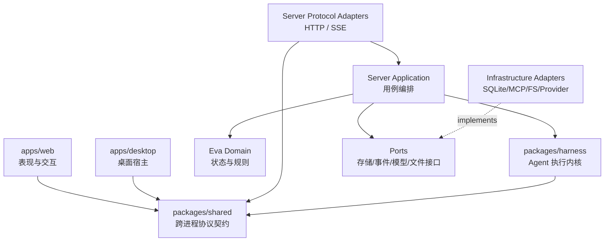
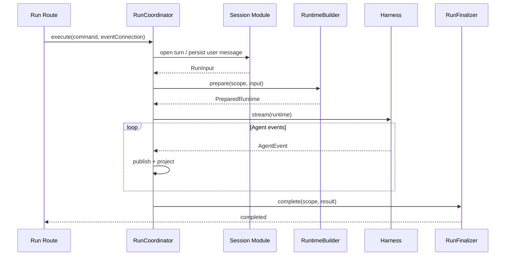

# Eva 简明架构总纲与渐进改造方案

> 状态：Review Draft（已逐条对账 2026-08-30 代码快照）
>
> 日期：2026-08-30
>
> 适用范围：`apps/server`、`packages/harness`、`packages/shared`、`apps/web`、`apps/desktop`、`tests/`、构建产物与架构文档
>
> 目的：作为 Eva 下一阶段架构收敛的总纲、模块改造依据，以及交给其他工程师或模型进行二次评审的自包含材料。
>
> 事实纪律：本文出现的所有行数、文件数和「哪些地方违反了哪条规则」都是在 `7066701` 这个提交上实测得到的，
> 不是估计。凡是**尚未实测**的判断，本文会写明「待核」。评审者可以直接复算：每条事实旁边都给了可执行的命令或路径。

---

## 阅读导航

- 只评审总体方向：阅读 0、2、3、5、6、13、16；
- 评审某个具体模块：先读 3 和 6，再读 7 中对应模块；
- 评审可执行性：重点阅读 **10.0**、10、11、12、13；
- 准备开始第一轮改造：阅读 **5.0**、5、7.2、8、11.4、12 的 **12.0 与 Wave 0–1**；
- 检查是否过度设计：重点阅读 2.2、**4.4**、C6、C7、5.2、5.3；
- 只想知道「今天的代码长什么样」：只读 **1.2**、**5.0**、6 三节。

如果只有十分钟，读这三处：**§1.2**（实测出来的九个问题，含「没有任何 linter」）、
**§5.0**（今天一次 Run 要跨 7 个文件，问题全在第 1 个）、**§12.0**（施工规约五条）。

本文中的“必须/禁止”表示目标架构的强约束；“应/建议”表示默认选择，偏离时需要在 Review 中说明理由；“可以/P3”表示可选优化。本文仍是 Review Draft，描述的是目标与迁移方案，不代表当前代码已经满足全部约束。

---

## 0. 执行摘要

Eva 不需要重写，也不需要替换 Fastify、Electron、React、SQLite 或 Vercel AI SDK。当前架构的基础方向是成立的：桌面壳、内嵌服务、Agent Harness、Shared 契约和 Web 前端已经有清楚的进程边界；真正的问题是随着能力增长，**应用编排、模块所有权、公开边界和当前架构文档没有同步收敛**。

本方案的核心不是“把大文件切成小文件”，而是建立五条长期有效的约束：

1. **协议层只翻译协议，应用层显式编排流程。**
2. **每份状态只有一个所有者和一个事实源。**
3. **跨模块只能通过公开能力协作，不能穿透到对方的 Repository 或内部文件。**
4. **每一次 Run 都能通过统一标识和事件账本还原因果链。**
5. **以上四条必须由脚本执行，而不是靠 Review 记得。**

第 5 条是本次对账新增的，也是最容易被低估的一条。实测发现 Eva 目前**没有任何 linter、
没有 CI、没有 `lint` script**（§1.2、§10.0）—— 也就是说前四条约束目前没有任何强制手段。
如果不先补上执行机制，本文会变成第 99 篇「写得对但没人遵守」的架构文档，
而这恰好是它想解决的问题本身。因此 Wave 0 的第一件事不是拆代码，是建立 `pnpm lint:arch` 与 CI。

目标架构采用“**仓库级单向依赖 + Server 内按业务模块垂直切分 + Harness 作为独立执行内核**”。不引入重量级 DDD 框架，不追求为每个类创建接口，也不建设全局 Event Bus。

第一优先级是改造 Run 主链：将当前 HTTP Handler 中的会话准备、模型路由、能力装配、Agent 执行、消息投影、观测和收尾，收敛到 `RunCoordinator` 与 `RunScope`。之后再逐步清除 Route 对数据库的直接访问、拆分 Harness 主循环、收敛前端大型组件和 Electron 主进程。

完成后，一个完全不了解 Eva 的工程师应当能够：

- 在 30 分钟内理解系统由哪些进程和核心模块组成；
- 在 10 分钟内找到一个功能的唯一入口、状态所有者和失败路径；
- 在不超过 5 个核心文件的跳转内读懂“发送一条消息”的主链；
- 仅凭 `runId` 定位一次执行经历了什么、卡在哪里、为何失败；
- 在增加功能时知道应该修改哪里，也知道哪些位置禁止修改。

---

## 1. 背景与当前问题

### 1.1 已经做对的部分

以下基础设计应保留：

- Electron、Server、Web 三个进程/运行时边界清楚；
- `packages/harness` 与 Fastify、React 解耦；
- SQLite 是本地持久化事实源；
- SSE 支持断线后重新挂载，断连不等于中止 Run；
- Run、Message、Approval、Run Event 已经是一等持久化概念；
- `run_events` 作为 append-only 调试账本，而不是依赖普通日志反推事实；
- Agent 以单一工厂入口装配，工具审批、并发帽、执行计时等横切行为已有明确顺序；
- Web 已按 `features/shared` 切分，并对流式渲染做了性能隔离；
- Plan Gate、Plan Weave、Memory、MCP、Subagent 等复杂能力已有独立实现，不需要推倒重建。

因此，本次工作的性质是**架构收敛**，不是架构替换。

### 1.2 当前复杂度热点

以下数字是 `7066701` 提交上的实测值，用于说明问题，不作为永久 KPI：

| 现象 | 实测值 | 复算方式 |
|---|---|---|
| Run 编排入口过载 | `apps/server/src/routes/runs.ts` 575 行 | `wc -l` |
| Agent 主循环过载 | `packages/harness/src/agents/agent.ts` 926 行 | `wc -l` |
| 桌面主进程过载 | `apps/desktop/electron/main.ts` 750 行，9 个职责段 | 文件内 `// ---- 段落分隔 ----` 注释 |
| Route 越过模块边界 | 18 个 route 文件中 **10 个**直接访问 `app.infra.db` 或 `new XxxRepository()`；扣掉 `index.ts` 与 `static.ts` 这两个非业务文件后，比例是 **10/16** | `grep -ln 'infra\.db\|Repository(' apps/server/src/routes/*.ts` |
| Web 组件过载 | `memory-settings` 664、`sidebar` 642、`provider-settings` 592、`derive-trajectory` 536、`trajectory-view` 456、`message-bubble` 382 行 | `wc -l` |
| 测试无法按模块定位 | `tests/` 下 **93 个测试文件全部平铺**，唯一子目录是 `helpers/` | `ls tests \| wc -l` |
| 文档需要考古 | `docs/**/*.md` 共 **98 篇 32201 行**，研究、历史计划、目标架构和当前事实混在一起 | `find docs -name '*.md' \| xargs cat \| wc -l` |
| 工作区里有陈旧代码副本 | `apps/desktop/.server-deploy/src/` 是一份 **93 个 `.ts` 文件的 server 源码副本**（打包中间产物，已 gitignore 但留在磁盘上），停在 migration `0025`，没有 `run_events`、没有 plan-weave | `diff -q apps/server/src/routes/runs.ts apps/desktop/.server-deploy/src/routes/runs.ts` |
| **没有任何边界检查工具** | 仓库内 **无 ESLint / Biome / oxlint / dependency-cruiser 配置，无 `.github/`，无任何 `lint` script** | `ls -a; ls .github; grep -rn '"lint"' package.json apps/*/package.json` |

最后一行是本节最重要的一条，它决定了后文 §10 的性质：**Eva 目前没有任何自动化手段阻止依赖方向被破坏**，
所有边界都只靠 Review 与自觉维持。

文件变大本身不是根因。根因是同一个文件同时承担多个“变化原因”。例如一次 Run 的 HTTP Handler 同时知道：

- Fastify 和 SSE；
- Session 与 Workspace；
- Run Registry 与 Run Ledger；
- Provider、Model 与 Skill 选择；
- Memory、MCP、Plan Gate、Plan Weave；
- Approval 与 Plan Review；
- Subagent 与 Report Gateway；
- Observer、Run Recorder 与 Message Recorder；
- 成功、失败、断连、中止与清理。

新增任何能力都容易继续进入这个入口，最终形成“所有功能都能找到，但没有人知道边界在哪里”的局面。

### 1.3 当前问题的四个根因

#### 根因 A：缺少明确的应用用例层

当前存在 Route、Service、Repository，但“完成一次用户动作需要如何编排多个模块”主要写在 Route 里。Route 因此从协议适配器演变为业务总控。

#### 根因 B：模块边界是目录约定，不是可执行约束

设计上希望依赖是 `routes -> services -> repositories`，但 Route 可以直接访问 DB，模块也可以导入其他模块的内部文件。目录表达了意图，编译器和 CI 没有执行这个意图。

这一条不是「执行得不够严」，而是**执行机制根本不存在**：实测仓库里没有 ESLint / Biome / dependency-cruiser
任何一种配置，没有 `.github/`，`package.json` 里也没有 `lint` script（§1.2 末行）。`tsconfig` 的 `strict`
只能保证类型正确，管不了「谁不许 import 谁」。

因此**任何以「加一条 lint 规则」为收尾动作的改造计划，在 Eva 上都隐含了一项没被算进去的前置工程**。
§10 与 §12 Wave 0 必须把这项前置工程显式列出来，否则整个方案会停留在纸面约定，
而纸面约定正是根因 B 本身。

#### 根因 C：运行期状态很多，但所有权没有统一表达

Run Registry、Run Ledger、Run Hub、Message Recorder、Approval Gateway、Run Event Recorder 都是合理概念，但如果不明确哪一个回答哪类问题，阅读者会误以为它们是重复状态，修改者也容易从错误的投影反推业务事实。

#### 根因 D：文档与测试都没有可预期的入口

**文档**：当前文档既记录外部产品研究，又记录 Eva 的目标架构、旧计划和已实现状态。新读者首先需要做文档考古，
才能判断代码为什么是现在这样。最尖锐的一处是 `docs/architecture/README.md` —— 它是整个架构目录的默认入口，
而它的标题是《Alma 架构拆解 · Agent 开发学习手册》，第一句写着「目标读者：想自己复刻一个 Alma 类 AI 桌面助手的
开发者」。一个新人打开 Eva 的架构文档，读到的第一句话会让他以为这个仓库是**另一个产品的逆向研究笔记**。

**测试**：`tests/` 下 93 个文件完全平铺。想知道「Plan Weave 的并发不变量在哪测的」只能靠猜文件名
（答案是 `plan-weave-store.test.ts`，而 `plan-weave-loop.test.ts`、`plan-weave-api.test.ts`、
`plan-weave-tools.test.ts` 是另外三层）。§9.1「新手阅读测试」的第 5 条要求「找到相应测试」，
按当前布局这条无法通过 —— 测试布局和文档布局是同一个根因的两个面：**没有一个可预期的入口。**

---

## 2. 目标与非目标

### 2.1 目标

#### G1：结构简单清晰

- 顶层目录能表达系统的主要能力；
- 每个业务能力有唯一入口；
- 主控制流是显式函数调用，不靠隐式事件链拼接；
- 读者可以从入口向内单向阅读，不需要来回跳层。

#### G2：模块低耦合

- 每个模块拥有自己的状态和不变量；
- 跨模块只依赖公开 API 或 Port；
- 基础设施可以替换，业务规则无需修改；
- 删除一个可选能力时，不需要修改整个 Run 生命周期。

#### G3：便于 Debug

- 每次 Run 有完整因果标识；
- 每个阶段有结构化开始、结束、耗时和错误；
- 产品状态、调试事实、普通日志和 UI 投影严格区分；
- 可从一个 `runId` 还原模型、工具、审批、子代理和持久化过程。

#### G4：便于人类阅读

- 主路径最多跨越约 5 个核心文件；
- 文件名表达业务责任，不使用模糊的 `utils/manager/processor`；
- 注释解释不变量和原因，不依赖历史任务编号；
- 当前架构入口文档不超过少量自包含文档。

### 2.2 非目标

本方案明确不做：

- 不一次性重写整个仓库；
- 不更换现有主要技术栈；
- 不为了“纯粹”把每个函数都包装成 Service 或 Interface；
- **不为只有一种实现的 SQLite 表造 `XxxStore` + `DrizzleXxxStore` 成对文件**（C6）；
- **不把现有文件改个名当成重构** —— 改名断掉 `git blame`，却不减少任何理解成本；
- 不引入全局 Event Bus 代替显式控制流；
- 不为了缩短文件而制造大量只有几十行、命名含糊的中转文件；
- 不把所有模块强行做成可动态加载的插件；
- 不在架构重构期间同时改变核心产品语义；
- 不用行数作为唯一质量指标；
- 不把 Shared 变成所有层都可以随意塞类型的垃圾场。

---

## 3. 设计原则：Eva 架构宪法

以下条款是规范性要求。后续实现和 Review 应以这些条款为准。

### C1：依赖只能朝稳定方向流动

外层可以依赖内层，内层不能反向认识外层：



仓库级允许的编译依赖：

| 来源 | 允许依赖 | 禁止依赖 |
|---|---|---|
| `apps/web` | `@eva/shared`、Web 内部模块 | `apps/server`、`@eva/harness`、数据库 |
| `apps/desktop` | 桌面内部模块、必要的 Shared 契约 | Server 内部 Service、Harness 内部实现 |
| `apps/server` | `@eva/harness`、`@eva/shared` | Web、Desktop |
| `packages/harness` | `@eva/shared`、AI SDK | Fastify、Drizzle、Eva DB、React、Electron |
| `packages/shared` | 极少量纯协议依赖 | Server、Harness、Web、Node 平台实现 |

### C2：协议层只翻译协议

HTTP/SSE Route 只能做：

1. 请求解析和 Zod 校验；
2. 调用一个应用用例；
3. 将领域错误映射为 HTTP 状态码；
4. 将应用事件编码成 SSE；
5. 处理连接建立与断开。

Route 禁止：

- 直接访问 DB；
- `new XxxRepository()`；
- 组装 Agent；
- 决定审批策略；
- 构造 Plan/Memory/Subagent Runtime；
- 修改多个模块的状态；
- 包含产品级事务流程。

### C3：应用层显式编排用例

应用层回答：

> 完成一个用户动作，需要按照什么顺序调用哪些能力？

典型应用用例包括：

- `StartRun` / `RunCoordinator.execute`；
- `AbortRun`；
- `AttachRunStream`；
- `RetryMessage`；
- `ApproveToolCall`；
- `CompactThread`；
- `CreatePlan` / `ReviewPlan`；
- `UpdateProvider`；
- `SearchThreads`。

应用层可以依赖领域规则和 Port，但不能依赖 Fastify Reply、SQL 查询细节或 React 状态。

### C4：每份状态只有一个所有者

每个模块必须说明：

- 拥有哪些表、文件或内存状态；
- 维护哪些不变量；
- 哪些操作可以修改状态；
- 哪些状态是事实，哪些只是投影；
- 谁可以读取，谁可以写入。

禁止模块 A 直接修改模块 B 拥有的表。跨模块写入必须调用 B 的公开命令。

### C5：能推导的状态不重复存储

如果一个字段可以可靠地从其他事实推导，就优先使用纯函数推导，而不是维护第二份可变状态。

允许冗余的情况只有：

- 明确的查询性能需要；
- 持久化当时的历史快照；
- 跨进程协议需要；
- 经过文档记录，并定义了更新者和修复策略。

例如：

- Session 展示状态应从运行中 Run、待审批请求和活跃后台任务推导；
- SSE 是投影，不是 Run 状态事实源；
- `search_text` 是 Message 的可重建索引投影；
- Run 当时使用的模型和 capture level 是历史快照，应持久化。

### C6：只在变化边界使用 Port

**门槛是硬的：今天就存在第二个实现，或者跨 package 边界。** 两条都不满足就直接用具体类。

「以后可能要换」不算变化边界 —— Eva 是本地优先桌面应用，SQLite 不会被换掉，
为它造 Port 只会买到一层 indirection。「方便测试」也不算：Eva 的测试已经用真 SQLite
（`initDb` + `migrateDb`，见 `tests/run-lifecycle.test.ts`），真库又快又保真，
换 in-memory 实现买不到任何东西。

按这把尺子量，Eva 里**真正值得 Port 的只有四类**：

| 值得 | 满足哪一条 |
|---|---|
| `LanguageModel`（AI SDK 提供） | 已有 5+ provider 实现；测试用 `MockLanguageModelV4` |
| MCP Client | 真有两种形态（stdio / http），且 `tests/helpers/fake-mcp-server.ts` 已存在 |
| `RequestApproval` / `RequestPlanReview` / `PlanWeaveGateway` | 跨 package 边界 —— harness 绝不能知道 DB 与 SSE |
| `Encryptor` | 今天就有两个实现：`AesGcmEncryptor` 与降级用的 `IdentityEncryptor` |

**明确不要 Port 的：** 每张 SQLite 表的 Repository / Store、时钟、UUID、文件系统、
以及任何只有一个实现的纯业务类。不要为它们创建 `XxxStore` + `DrizzleXxxStore` 这样的成对文件 ——
那是两个文件、一层跳转，换来零灵活性。Repository 就叫 `xxx-repository.ts`，
直接实例化，由组合根注入。

不要为每个只有一个实现的纯业务类创建 `IXxxService`。接口的价值是隔离变化、支持替换和测试，
不是提高抽象数量。

**但要区分「Port」与「能力收窄接口」—— 后者不受本条约束。** 为同一个实现声明多个受限视图
（`RunOpeningLedger` / `RunSettlingLedger`、`SessionReader` / `SessionWriter`）
不是为了替换实现，而是为了让调用方**拿不到它不该有的方法**，把不变量交给编译器而不是 Review。
判别方法：**Port 的两侧是不同实现；能力收窄的两侧是同一实现的方法子集。**
后者鼓励使用 —— 它是本方案里最便宜的一种强制手段：零新增工具、编译期生效。

### C7：控制流用直接调用，旁路投影用事件

必须立刻成功、失败会改变主流程的行为使用显式调用：

```text
open session -> resolve runtime -> execute agent -> persist message -> settle run
```

同一事实发生后，多个消费者独立处理的旁路行为可以使用事件：

```text
tool_call_completed
  -> observability append
  -> SSE projection
  -> UI message projection
  -> usage projection
```

禁止用全局事件总线隐藏核心业务顺序。关键持久化不能只依赖“希望某个订阅者稍后处理”。

### C8：具体实现只能在组合根装配

除组合根和模块内部的 Adapter 外，禁止创建 Repository、Provider Client、MCP Client 等具体基础设施对象。

组合根必须是回答以下问题的唯一位置：

> Eva 运行时到底由哪些具体实现组成？

### C9：每个模块只有一个公开入口

跨模块只能从目标模块的 `index.ts` 或明确的 package subpath 导入。

模块的内部文件默认私有。禁止为了方便直接导入另一个模块的 `internal`、Repository 或临时 Helper。

### C10：生命周期资源必须由 Scope 管理

具有一次 Run 生命周期的资源，应集中进入 `RunScope`：

- `runId` / `sessionId`；
- AbortController；
- Run Hub；
- Run Recorder；
- failure layer；
- Plan Gate State；
- Report Gateway；
- 清理函数集合。

`RunScope.dispose()` 必须幂等，并统一完成取消 pending approval、释放 report gateway、注销 registry、关闭订阅者等工作。

### C11：错误必须结构化

跨层错误至少包含：

```ts
interface EvaFailure {
  code: string;
  layer:
    | "routing"
    | "context"
    | "model"
    | "tool"
    | "persistence"
    | "orchestration"
    | "transport";
  operation: string;
  retryable: boolean;
  userMessage: string;
  cause?: unknown;
}
```

用户看到 `userMessage`，HTTP Adapter 根据 `code` 映射状态码，调试账本记录 `layer/operation/cause`。禁止通过匹配错误字符串决定业务行为。

### C12：注释解释不变量，不记录施工历史

代码注释应解释：

- 为什么顺序不能改变；
- 为什么这份状态必须共享；
- 删除约束会产生什么故障；
- 哪个稳定 ADR 记录了设计决定。

`T44`、`T48`、`S7` 等历史任务号不应成为理解代码的前置条件。任务历史保留在 Plan 或 Git 中，稳定决策进入 ADR。

---

## 4. 目标目录结构

### 4.1 总体原则

采用“仓库按运行时分包，Server 内按业务能力垂直切分”。

下面是最终稳定形态。**本轮改造已批准物理搬迁到这个结构**（不是「新模块遵守、旧模块慢慢靠拢」），
但搬迁按 Wave 分批进行，每批自成一个可提交、可回滚的单元。

搬迁期间允许新旧路径共存，规则只有三条，必须严格执行：

1. **旧路径只能退化成一行 re-export shim**，不允许出现「两个都有实现」的状态：

   ```ts
   // apps/server/src/services/session.ts   —— 搬迁期 shim,勿在此新增任何代码
   export * from "../modules/sessions/index.js";
   ```

2. **shim 的数量必须单调下降**，且在它所属 Wave 结束时清零。加一个 shim 就必须同时登记它的清除 Wave。
3. **纯移动与逻辑修改必须是不同的 commit。** 一个 `git mv` + import 改写的 commit 里不允许夹带任何
   行为变化；反过来，逻辑重构的 commit 里不允许夹带文件移动。这条是本轮改造能否被 review 的关键 ——
   混在一起的 diff 无法判断「行为有没有变」，而本轮的前提正是「不影响任何现有功能」。

```text
apps/
  desktop/                    # Electron 宿主
  server/
    src/
      bootstrap/              # 启动、组合根、生命周期
      platform/               # DB、config、crypto、logging、path
      modules/
        runs/
        sessions/
        approvals/
        providers/
        settings/
        memory/
        workspaces/
        plan-gate/
        plan-weave/
        subagents/
        mcp/
        observability/
        search/
        usage/
      transports/             # HTTP/SSE 通用传输代码
  web/                        # React 表现层

packages/
  harness/                    # Agent 执行内核
  shared/                     # 跨进程协议契约
```

### 4.2 业务模块内部结构

小模块保持扁平，不要预先创建五层空目录：

```text
modules/approvals/
  approval-gateway.ts         # pending promise + 决策
  approval-policy.ts          # 「始终允许」policy key 匹配
  approval-repository.ts      # SQL,直接实例化,不造 Port(见 C6)
  approval-routes.ts          # HTTP Adapter
  index.ts                    # Public API
```

注意这个示例**没有** `approval-store.ts`(Port) + `drizzle-approval-store.ts`(Adapter) 这一对。
按 C6 的门槛，approval_requests 表永远只有一种实现，成对文件买不到任何东西。

只有当文件数和职责明显增长后，再在模块内部创建：

```text
modules/runs/
  application/
  domain/
  adapters/
  index.ts
```

这条规则避免“为了架构图好看，实际阅读要穿过大量目录”。

### 4.3 技术共享代码的进入条件

一个实现只有同时满足以下条件，才可以进入 `platform` 或 `shared`：

1. 至少被三个业务模块真实使用；
2. 没有明显业务所有者；
3. 名称能准确描述职责；
4. API 比复制少量代码更稳定；
5. 不会让调用方绕过模块边界。

禁止新增笼统的 `utils.ts`、`helpers.ts`、`common.ts` 作为临时收纳箱。

### 4.4 本仓库判例：哪些大文件该拆，哪些不该拆

§9.4 给了通用判据，但通用判据在具体文件上还是会吵架。以下是对当前几个最大文件的**已决判例**，
直接照用，不要在每次 Review 里重新辩论一遍：

| 文件 | 行数 | 判决 | 理由 |
|---|---|---|---|
| `apps/server/src/routes/runs.ts` | 575 | **必须拆** | 同时承担 HTTP、SSE、会话、模型、能力装配、审批、子代理、观测、收尾九类变化原因 |
| `packages/harness/src/agents/agent.ts` | 926 | **必须拆** | loop 推进、恢复策略、终态汇总、遥测发射四类变化原因缠在一个 `run()` 里 |
| `apps/desktop/electron/main.ts` | 750 | **必须拆** | 文件自己用 `// ---- 段落 ----` 划出了 9 个互不相关的区块，等于自证多职责 |
| `apps/web/.../sidebar.tsx` | 642 | **必须拆** | 数据获取、重命名/删除命令、搜索、列表投影、右键菜单、纯展示混在一个组件 |
| `apps/web/.../memory-settings/index.tsx` | 664 | **必须拆** | 表单、列表、统计聚合、危险操作四类职责同文件 |
| `apps/server/src/db/schema.ts` | 467 | **不拆亦可** | 纯 schema 声明，单一变化原因；按领域分文件是 P2 的可读性优化，不是解耦要求 |
| `apps/web/.../derive-trajectory.ts` | 536 | **不拆亦可** | 单一纯投影器，无副作用、无 IO；拆成多个 projector 只在事件族继续增长时才划算 |
| `packages/harness/src/context/runtime-compact.ts` | 471 | **不拆亦可** | 单一算法族（估算 + 压缩），有完整单测覆盖 |

判例的意义是：**「行数超标」永远不是拆分理由，「同一文件里有两个会因不同原因而改动的东西」才是。**
新增大文件时，把它放进上表并给出判决，而不是留给下一个读者去猜。

---

## 5. 核心 Run 生命周期

### 5.0 今天的主链长什么样（先看现状，再看目标）

> **本节的「现状」表已被 Wave 1 推翻（2026-08-30）。** 下表描述的是 Wave 1 之前的形态，
> 保留它是因为后面「问题全部集中在第 1 个」那段分析是整个 §7.2 的出发点。
> Wave 1 之后的实际形态见本节末尾的落地表。

「发送一条消息」这条主链在 Wave 1 之前要跨 **7 个文件**才能读完，按真实调用顺序：

| # | 文件 | 它在这条链上干什么 |
|---|---|---|
| 1 | `apps/server/src/routes/runs.ts` | 建 runId、注册 registry/hub、定义审批与 plan review 闭包、按顺序调用下面全部、收尾与错误映射 |
| 2 | `services/runs/run-preparation.ts` | `prepareRunInput`（会话互斥、落用户消息、定 `modelId`、绑 workspace）与 `prepareRunContext`（compact、历史转换、记忆上下文） |
| 3 | `services/agent-factory.ts` | `build()`：解析 chat/tool 模型槽位 → 装工具集 → 组 prompt sections → `createAgent` |
| 4 | `packages/harness/src/agents/agent.ts` | `createAgent` 装工具管道（planGate → approval → cap → timing），`Agent.run()` 驱动 `streamText` 主循环 |
| 5 | `services/runs/assistant-message-recorder.ts` | 把流式事件投影成 `EvaUIMessage` 并落库 |
| 6 | `services/runs/run-ledger.ts` | `start / patchRouting / settle / fail`：`runs` 表的终态 |
| 7 | `services/runs/run-hub.ts` + `transports/sse/event-stream.ts` | 扇出给订阅者、SSE 帧编码与心跳 |

这 7 个文件本身职责都算清楚，**问题全部集中在第 1 个**：它是唯一知道全部另外 6 个的地方，
所以任何新能力都会继续往它里面加。§9.2 的五文件预算在这条链上是超标的，超标的原因不是文件多，
而是第 1 个文件同时是协议适配器和业务总控。

目标是把第 1 个文件拆成「协议适配器 + 编排者」两个，其余保持不动：

| # | 目标文件 | 责任 |
|---|---|---|
| 1 | `modules/runs/run-routes.ts` | 只做 schema 校验、SSE 连接、调用用例、错误 → HTTP 状态码 |
| 2 | `modules/runs/run-coordinator.ts` | 五阶段骨架，不含任何一个阶段的细节 |
| 3 | `modules/runs/run-runtime-builder.ts` | 显式装配 Skill / Memory / Plan / MCP / Subagent |
| 4 | `packages/harness/.../agent.ts` | 只剩 façade 与主循环骨架 |
| 5 | `modules/runs/run-finalizer.ts` | settle / fail / rollback / end / cleanup 的唯一出口 |

#### Wave 1 落地后的实际形态（2026-08-30）

拆分已完成，但**落点不是 `modules/runs/`** —— 新文件先落在 `services/runs/`，
`modules/` 的目录搬迁是 Wave 4 的事（§12.0 规约 2：纯移动 commit 与逻辑 commit 分开）。
`routes/runs.ts` 从 575 行降到 101 行：

| 文件 | 行数 | 它在这条链上干什么 |
|---|---|---|
| `routes/runs.ts` | 101 | 三条端点；SSE 连接；`RunOutcome` → 409 / 503 / 400；注册表 404 语义。**没有业务顺序** |
| `services/runs/run-coordinator.ts` | 351 | 五阶段顺序 + 13 行流式循环 + 内联 `RunScope`。**只有顺序**，没有装配也没有终态 |
| `services/runs/run-runtime-builder.ts` | 300 | 「这轮 agent 能用什么」：skill / 记忆 / plan gate / MCP / plan weave / 子代理 / 观测三件套 |
| `services/runs/run-approval-channel.ts` | 195 | 四级放行链 + 子代理自动通过 + plan review 平行通道 + 两个 `lookup*Decision` |
| `services/runs/run-finalizer.ts` | 124 | 终态的唯一出口：`settle` / `fail` / `closeWithError`，外加 `release` |

**主链在 5 个文件内读完**（退出条件的原文）：`run-routes` → `run-coordinator` →
`run-runtime-builder` → `agent.ts` → `run-finalizer`。`run-preparation` / `run-ledger` /
`run-hub` / `assistant-message-recorder` 仍在链上，但它们是被调用的能力，不是要按顺序读的编排。

两处与本节目标表的偏差，都记在这里免得下一个人以为是漏做：

1. **`RunScope` 有 `dispose` 吗？没有。** §7.2 的 P2 动作 8 提到「为 `RunScope.dispose`
   添加幂等测试」，但落地时资源释放归了 `RunFinalizer.release()`。让 `RunScope` 也有一个
   `dispose` 会立刻制造第二条清理路径 —— 而这一整节存在的理由就是「终态只有一个出口」。
   要补的幂等测试应该针对 `release()`。
2. **schema parse 在 coordinator，不在 route。** 原因是 `runRegistry.register(runId)`
   发生在看 body **之前**，所以校验失败也必须走同一套 `finally` 清理。把 parse 提到 route
   会留下一个没人 `unregister` 的 runId。想把它挪回 route，得先把 `register` 推到 parse 之后 ——
   那是行为改变（畸形 body 不再短暂占用一个 runId），本轮不做。

### 5.1 目标主链

一次 Run 固定经过五个应用阶段：



五个阶段及其责任：

| 阶段 | 责任 | 明确不做 | 今天对应的代码 |
|---|---|---|---|
| Open | 会话互斥、创建/重试消息、绑定 Workspace、**选定 `modelId`**、创建 Run 台账行 | 不解析 provider 绑定、不装 Agent | `prepareRunInput` + `runLedger.start` |
| Prepare | 把 `modelId` 解析成 provider 绑定、选择 Skill、准备 Memory/Plan/MCP、构造 Agent Runtime、构造模型可见历史 | 不开启 SSE、不落 assistant 终态 | `agents.build` + `prepareRunContext` |
| Execute | 驱动 Harness、发布事件、更新消息投影 | 不决定 HTTP 错误码 | `for await (agent.stream)` + `AssistantMessageRecorder` |
| Complete | 完成 assistant message、usage、Run 终态、end frame | 不重复执行业务准备 | `messageRecorder.finish` + `runLedger.settle` |
| Fail/Dispose | 结构化失败、必要回滚、取消 pending、释放资源 | 不吞掉原始 cause | `catch` / `finally` 块 |

Open 阶段的措辞需要格外精确，因为这里有一个容易改错的地方：**「选定 `modelId`」属于 Open，「把 `modelId`
解析成 provider 绑定」属于 Prepare。** retry 分支的模型来源是 `body.modelId ?? sessions.model`
（见 `prepareRunInput`），这个决定必须留在 Open —— 它依赖被重试消息所在的会话记录，Prepare 阶段读不到。
把它一起搬进 Prepare 会让 retry 丢掉「沿用被重试那轮的模型」这个语义。

同样地，`runLedger.start()` 必须留在**模型解析之前**（现状即如此，T48 的刻意设计）：provider 配错、
模型不可用时也要留下一行 `failure_layer=routing` 的台账。重构时若为了「阶段更干净」把建台账挪到
Prepare 之后，routing 失败就会变成查不到的 Run。

### 5.2 RunCoordinator 不应成为新 God Object

`RunCoordinator` 只保留五阶段骨架，把细节委托给具名协作者：

```ts
class RunCoordinator {
  constructor(
    private readonly opener: RunOpener,
    private readonly runtimeBuilder: RunRuntimeBuilder,
    private readonly executor: RunExecutor,
    private readonly finalizer: RunFinalizer,
  ) {}
}
```

优先使用普通对象和函数，不要求每个协作者都是 Class。

### 5.3 能力装配保持显式

初期不要引入通用 `RunPlugin` 或任意生命周期 Hook。`RunRuntimeBuilder` 应显式列出当前能力：

```ts
const skills = await skillRuntime.prepare(context);
const memory = await memoryRuntime.prepare(context);
const plans = await planRuntime.prepare(context);
const mcpTools = await mcpRuntime.tools(context);
const subagents = subagentRuntime.prepare(context);

return agentFactory.build({
  tools: [...memory.tools, ...plans.tools, ...mcpTools, ...subagents.tools],
  promptSections: [...skills.sections, ...memory.sections, ...plans.sections],
});
```

显式代码比抽象 Hook 更容易阅读和 Debug。只有未来至少三个独立能力反复呈现完全相同、稳定的装配协议时，才考虑提取 `RuntimeContribution`。

---

## 6. 状态所有权与事实源

表里多一列「今天的代码位置」—— 没有这一列，读者知道了「谁拥有」却仍然找不到文件，
这张表就只是一张概念表，起不到定位作用。

| 领域 | 唯一事实源 | 内存状态/投影 | 唯一写入者 | 今天的代码位置 |
|---|---|---|---|---|
| Session 基本信息 | `sessions` | Sidebar 查询结果 | Session Module | `services/session.ts`、`db/repositories/session-repository.ts` |
| 消息与分支 | `messages.message` + parent/slot/depth | Streaming message builder | Session/Message Module | `services/message-tree.ts`、`db/repositories/message-repository.ts` |
| Run 持久化终态 | `runs` | 当前请求的 `RunScope` | Runs Module | `services/runs/run-ledger.ts`、`db/repositories/run-repository.ts` |
| Run 是否在本进程可控制 | `RunRegistry`（进程内，**不落库**） | UI running 状态 | Runs Module | `services/run-registry.ts` |
| Run 调试事实 | `run_events` | Trajectory projection | Observability Module | `services/observability/run-recorder.ts`、`db/repositories/run-event-repository.ts` |
| 审批决定 | `approval_requests` | pending deferred promise、审批卡片 | Approval Module | `services/approval-gateway.ts`、`db/repositories/approval-repository.ts` |
| Approval policy | `settings.security.allowAlwaysPolicies` | 进程内 key set | Approval Module，经 Settings Module 写回 | `services/approval-policy-store.ts` |
| Provider 配置 | `providers` | LanguageModel cache | Provider Module | `services/providers/provider-repository.ts`；缓存在 `services/agent-factory.ts` |
| 应用设置 | `settings` | 每 Run 设置快照 | Settings Module | `services/settings/app-settings.ts` |
| Skill Catalog | 已加载的 `SKILL.md` 文件集合 | 当前进程 catalog（`infra.skills`） | Skills Module | `deps.ts` 的 `loadSkills`、`packages/harness/src/skills/loader.ts` |
| Session Skill 选择 | `session_skill_selections` | 每 Run selection snapshot | Skills Module | `services/skills/select-run-skills.ts`、`db/repositories/session-skill-selection-repository.ts` |
| Memory 搜索事实 | `memories` + embeddings/FTS | recall context | Memory Module | `services/memory/`、`db/repositories/memory-repository.ts` |
| 人类可读 Memory | `~/.eva/MEMORY.md`、daily files | prompt section | Memory Module | `services/memory/memory-file-store.ts` |
| Workspace | `workspaces` | 当前 Session 绑定结果 | Workspace Module | `services/workspaces/workspace-store.ts` |
| Plan Gate | `plans` + `<ws>/.eva/plan-gate/` | run-scoped gate state | Plan Gate Module | `services/plan-gate/service.ts`、`db/repositories/plan-repository.ts` |
| Plan Weave | `<ws>/.eva/plan-weave/` | ready 推导、锁内快照 | Plan Weave Module | `services/plan-weave/plan-file-store.ts` |
| 后台子代理任务状态 | `background_tasks` | live runner | Subagent Module；child message/run 仍由各自模块写入 | `services/subagents/sqlite-task-store.ts` |
| MCP Server 配置 | `mcp_servers` | live connections + tool definitions | MCP Module | `services/mcp/mcp-registry.ts`、`db/repositories/mcp-server-repository.ts` |
| Usage | `usage_records` / Run usage 快照 | UI 聚合 | Usage Module | `db/repositories/usage-record-repository.ts`、`services/session-usage.ts` |
| SSE | 无持久化权威 | Run Hub 扇出集合 | Transport projection only | `services/runs/run-hub.ts`、`transports/sse/event-stream.ts` |

其中两条不变量在重构里最容易被「顺手」破坏，单独点名：

- **`RunRegistry` 刻意不持有 `sessionId`。** 审批的归属键是 `runId`（`ApprovalGateway.cancelByRun`）。
  一旦 registry 知道了会话，下一个人就会把它当归属源用，`runId` 与 `sessionId` 会各自长出一套取消语义。
  代码注释已经写明这一点，重构时不要为了「方便查会话」加这个字段。
- **`RunHub` 与 `RunRegistry` 已经同寿，且 hub 已经是 registry entry 的私有字段**，只通过 `hubFor(runId)`
  暴露。它们不是两份重复状态，不需要合并，也不要拆开。

规则：

- 读取其他模块的数据优先调用 Query API；
- 写其他模块的数据必须调用 Command API；
- 为性能建立的投影必须可从事实源重建；
- 所有缓存必须有明确失效入口；
- 进程崩溃后无法恢复的内存状态，不能作为业务终态依据。

---

## 7. 模块改造方案

本节描述每个现有模块的目标职责和渐进改造动作。优先级：

- **P0**：阻断复杂度继续增长；
- **P1**：核心主链收敛；
- **P2**：阅读性和边界完善；
- **P3**：可选优化。

### 7.1 Bootstrap、Infrastructure 与 Service Assembly

#### 当前问题

- `deps.ts`、`services/index.ts` 和 Fastify `app.infra/app.services` 只装配了一部分能力；
- Route 仍能拿到原始 DB、config、encryptor，并自行创建 Repository；
- `AppServices` 暴露的是具体类集合，不是面向用例的公开能力。

#### 目标职责

- `bootstrap` 负责进程启动、迁移、stale sweep、retention、静态资源和生命周期；
- `composition-root` 负责创建所有具体 Store、Adapter、Module API 和 Use Case；
- Route 只拿到应用用例与 Query API，不拿原始 DB；
- `platform` 提供 config、db、crypto、logger、path 等技术实现。

#### 改造动作

1. **P0**：规定新 Route 不得访问 `app.infra.db`；
2. **P1**：新增 `AppApi`，按业务模块暴露 `runs/sessions/approvals/...`；
3. **P1**：将全部 Repository 创建移动到组合根或所属模块内部；
4. **P2**：Route 不再直接获得 `encryptor`、Repository 和可变 Runtime Registry；
5. **P2**：将启动清扫与请求期装配分离，避免 `deps.ts` 继续膨胀；
6. **P3**：为组合根增加 smoke test，验证关键服务只实例化一次、依赖无环。

### 7.2 Runs

#### 当前问题

`routes/runs.ts` 是当前最大应用编排热点。审批闭包、Plan Review、Observer、MCP、Skill、Plan、Subagent、Message Recorder 和清理逻辑都在 HTTP Handler 中。

#### 目标职责

Runs 模块拥有：

- Run 生命周期；
- Run Scope；
- Live Run Registry/Hub；
- Run 持久化状态；
- Start、Attach、Abort 三个应用用例；
- Agent Event 到产品事件的主投影顺序。

#### 建议结构

先看 `runs.ts` 575 行的实测分区 —— 目标结构必须从这里推导，不能从分层模板抄：

| 区块 | 行数 | 独立的变化原因 |
|---|---|---|
| 审批闭包 + 决策查询 | 109 + 20 | 审批策略（直放顺序、policy 记忆） |
| 能力装配（skill / memory / planGate / mcp / planWeave） | 84 | 「本轮 agent 能用什么」 |
| 子代理装配 | 76 | 同上 |
| 收尾 + `catch` + `finally` | 66 | 终态与资源释放 |
| 阶段①+台账+观测 / 路由回填 / 流式循环 | 58 + 31 + **13** | 编排顺序本身 |
| setup | 32 | HTTP / SSE 协议 |

**流式循环只有 13 行** —— 它不配一个文件。任何把它单独立成 `run-executor.ts` 的方案，
都违反 §2.2「不为了缩短文件而制造大量只有几十行的中转文件」。

目标结构（**11 个文件里 6 个是搬家，只有 5 个是新概念**）：

```text
modules/runs/
  run-routes.ts                    # 新   ~70   schema / SSE 连接 / 错误码映射
  run-coordinator.ts               # 新  ~150   五阶段顺序 + 流式循环 + RunScope(内联)
  run-approval-channel.ts          # 新  ~130   三个审批闭包 + 两个决策查询
  run-runtime-builder.ts           # 新  ~160   本轮能力装配(含子代理)
  run-finalizer.ts                 # 新   ~70   终态唯一出口
  run-preparation.ts               # 搬家  250  今天在 services/runs/
  run-ledger.ts                    # 搬家   60  今天在 services/runs/
  run-registry.ts                  # 搬家   48  今天在 services/
  run-hub.ts                       # 搬家  100  今天在 services/runs/
  assistant-message-recorder.ts    # 搬家  171  今天在 services/runs/
  run-repository.ts                # 搬家  304  今天在 db/repositories/,名字不改
  index.ts
```

三处刻意的取舍，都是对「抽象数量」的克制：

- **不造 `run-store.ts` + `drizzle-run-store.ts` 这一对 Port/Adapter。** `runs` 表永远只有
  一种实现，且测试本来就用真 SQLite（C6）。保留 `run-repository.ts` 这个名字，不改名。
- **不造 `run-opener.ts`。** 它只是 `prepareRunInput` 换个名字 —— 纯 churn，还断了 `git blame`。
  `run-preparation.ts` 原样搬过来。
- **`RunScope` 不单独成文件。** 它约 50 行、只有 coordinator 一个使用者，写在
  `run-coordinator.ts` 里与使用者同处。涨过 80 行或出现第二个使用者时再拆。

**`run-finalizer.ts` 保留独立文件（已决，2026-08-30）。** 理由不是行数（只约 70 行），
而是「Run 的终态只有一个出口」这条不变量需要一个物理落点 —— 放进 coordinator，
下一个人就会在某个 `catch` 里直接写 `runLedger.fail(...)`，开出第二个终态出口。

#### 怎么守住这条不变量：用编译器，不用 lint

现状实测：`settle` / `fail` 今天只有 `routes/runs.ts` 两处调用（473、500 行）；
`start` / `patchRouting` 也只在同一个文件。Wave 1 之后的期望归属是
**`start` / `patchRouting` → coordinator（Open 阶段），`settle` / `fail` → finalizer**。

用 lint 守这件事是弱的：§10.0 的脚本只扫 import，扫不出「import 了 `RunLedger` 之后调了
`.settle()`」；改成扫 `.settle(` 这种符号级文本匹配，别人把变量名从 `runLedger` 改成 `ledger`
就漏了。**把 `RunLedger` 的类型按能力切两半，让 TypeScript 直接拒绝**：

```ts
// modules/runs/run-ledger.ts
/** Open 阶段能做的:建行、回填路由。 */
export interface RunOpeningLedger {
  start(input: StartRunOptions): void;
  patchRouting(runId: string, requested: string, resolved: string): void;
}

/** 终态。只有 RunFinalizer 拿得到这个类型。 */
export interface RunSettlingLedger {
  settle(runId: string, options: SettleRunOptions): void;
  fail(runId: string, error: string, options?: { failureLayer?: RunFailureLayer }): void;
}

export class RunLedger implements RunOpeningLedger, RunSettlingLedger { /* 不变 */ }
```

- `RunCoordinator` 的构造参数声明为 `RunOpeningLedger` —— 它**看不见** `settle` / `fail`；
- `RunFinalizer` 的构造参数声明为 `RunSettlingLedger`；
- 组合根注入同一个 `RunLedger` 实例（C8），两个窄类型只是它的两个视图。

这样不需要新增任何工具，编译期就拦住了，而且比 lint 更早、更准。唯一的漏洞是
「有人在 coordinator 里直接 import `RunLedger` 具体类」—— 这恰好是一条**纯 import 规则**，
§10.0 的脚本天生擅长：`只有组合根与 run-finalizer.ts 可以 import RunLedger 具体类`。

> **这不是 Port，不要拿 C6 反驳它。** C6 禁止的是「为只有一个实现的类造 `IXxxService`
> 以便将来替换」。这里两个接口不是为了替换，而是**能力收窄**：同一个实现的两个受限视图，
> 目的是让调用方拿不到它不该有的方法。§7.3 提出的 `SessionReader` / `SessionWriter`
> 是同一个模式。判别方法很简单：Port 的两侧是**不同实现**，能力收窄的两侧是**同一实现的子集**。

#### 改造动作

提取顺序按**风险升序**排，而不是按概念优先级 —— 每一步做完 `runs.ts` 都更短，
且可以停在任何一步：

1. **P0**：补齐 Start/Retry/Abort/Disconnect/Approval pending/Agent error 的 characterization tests；
2. **P1**：提取 `RunApprovalChannel`（575 → 446 行）。最安全的一步：三个闭包是纯函数式的，
   不碰生命周期。**必须保持现有短路顺序**：bash 只读直放 → plan 文件直放 → policy 命中 → 才弹窗；
3. **P1**：提取 `RunRuntimeBuilder`（446 → 286 行）。最机械的一步：依赖多但没有控制流；
4. **P1**：提取 `RunFinalizer`（286 → 220 行）。开始碰 `catch`/`finally`，靠第 1 步的测试兜底；
5. **P1**：把剩下的 220 行劈成 `run-routes.ts` + `run-coordinator.ts`，`RunScope` 内联在后者；
6. **P1**：加 lint 规则锁住「只有 `run-finalizer.ts` 能 import `run-ledger.settle/fail`」；
7. **P2**：将 `runPhase` 替换为显式状态转换；
8. **P2**：为 `RunScope.dispose` 添加幂等、部分初始化和异常清理测试；
9. **P3**：把「`RunRegistry` 不持有 `sessionId`」「Hub 与 Registry 同寿」写成 registry 的单测断言 ——
   这两条现在只活在代码注释里，注释挡不住下一次「顺手加个字段」。

### 7.3 Sessions、Messages 与 Message Tree

#### 当前问题

- Session CRUD、Message 记录、分支树、状态、用量、compact 入口分散；
- `routes/threads.ts` 承担多类 Query 和 Command；
- Route 直接创建 Session/Message/Run/BackgroundTask Repository。

#### 目标职责

Sessions 模块拥有：

- Session 元数据；
- Message 树及 active leaf；
- 新建、继续、重试、删除和重命名；
- 构建模型历史；
- Session 状态纯推导；
- Session 查询视图。

Usage、Compact、Search 作为独立模块通过 Session Query API 读取，不直接更新 Session 内部表。

#### 改造动作

1. **P1**：把 Thread Route 拆成命令用例和查询用例，不按 HTTP 端点堆在一个文件；
2. **P1**：将 active leaf、retry、version branch 不变量集中到 Message Tree 领域代码；
3. **P1**：禁止 Run Preparation 自行创建 Session/Message Repository，改依赖 Session API；
4. **P2**：定义 `SessionReader` 与 `SessionWriter`，Query 不获得写能力 —— 这是 C6 说的「能力收窄接口」而非 Port（同一实现的两个方法子集），与 `RunOpeningLedger` / `RunSettlingLedger` 同一个模式，鼓励使用；
5. **P2**：将 `session-status.ts` 保持为纯投影并补状态优先级测试；
6. **P2**：为 Message JSON、search text、branch metadata 明确事实与派生关系；
7. **P3**：根据查询量考虑独立 `ThreadViewRepository`，但不让它成为第二份写模型。

### 7.4 Approvals 与 Security Policy

#### 当前问题

- Approval Gateway、Policy Store、HTTP Route、Run 闭包和 Harness wrapper 跨越多层；
- 普通审批与 Plan Review 共享持久化但具有不同协议；
- 自动批准原因、policy 命中、SSE 投影由 Run Route 拼接。

#### 目标职责

Approval 模块拥有：

- pending request 与 deferred promise；
- 普通审批和 Plan Review 的创建、决策、取消；
- policy match/grant；
- 自动批准原因；
- 决策事实查询。

Harness 只认识 `RequestApproval` / `RequestPlanReview` Port，不认识数据库和 SSE。

#### 改造动作

1. **P1**：新增 `RunApprovalChannel`，把业务策略与 SSE 事件组合封装在 Server 应用层；
2. **P1**：普通审批与 Plan Review 使用显式不同的命令类型，避免 boolean 协议扩张；
3. **P1**：统一 `cancelByRun` 的终态语义和幂等性；
4. **P2**：将 readonly-safe、plan-file、policy-hit 的判定写成可独立测试的决策链；
5. **P2**：Route 仅调用 `decideApproval` / `decidePlanReview` 用例；
6. **P2**：在持久化层约束每个 callId 只能完成一次合法决策。

### 7.5 Providers、Models 与 Settings

#### 当前问题

- Provider HTTP、Repository、Model Resolver、Settings、Agent Factory 的缓存失效彼此耦合；
- Provider Route 直接操作 Repository，并手动调用 `agents.invalidate()`；
- 配置变更副作用依赖调用方记得执行。

#### 目标职责

- Provider 模块拥有 provider 配置、apiKey 加密边界、模型发现；
- Settings 模块拥有应用设置；
- Model Routing 读取 Provider + Settings，输出不可变的 Run Routing Snapshot；
- Provider/Settings 更新用例负责验证、持久化和触发缓存失效；
- Route 不直接触碰加密器或 Agent cache。

#### 改造动作

1. **P1**：把 create/update/delete/discover provider 收敛为 Provider Commands；
2. **P1**：缓存失效成为 Provider/Settings Command 的内部后置动作；
3. **P1**：`AgentFactory.resolveModels` 只消费 Model Routing API，不直接读取 DB；
4. **P2**：把 `provider-repository.ts` 中的 SQL 与 provider 业务校验分开；
5. **P2**：保存 Run 级 `RoutingSnapshot`，明确 requested/resolved/tool model；
6. **P2**：Settings Route 只调用 `getSettings` / `replaceSettings`；
7. **P3**：为 Provider 探活和模型发现定义统一、可超时的 Client 抽象 —— 它满足 C6
   （`openai-compatible` 与 `anthropic` 两套探活协议今天就并存），但只做这一层，
   不要顺手给 provider 表也造 Port。

### 7.6 Agent Factory 与 Runtime Builder

#### 当前问题

`AgentFactory` 同时承担模型解析、模型实例缓存、主 Agent 工具装配、Prompt 组装、Plan Gate 注入和 Subagent 构建。

#### 目标职责

- `ModelRegistry`：LanguageModel 实例缓存；
- `ModelRouter`：解析 chat/tool/embedding 等槽位；
- `ToolCatalogBuilder`：构造某个 Runtime 可用的基础工具；
- `PromptComposer`：从显式 sections 组装 prompt；
- `AgentFactory`：消费已经准备好的模型、工具、prompt 和策略，创建 Harness Agent；
- `RunRuntimeBuilder`：Eva 应用层能力装配总入口。

#### 改造动作

1. **P1**：先把 Eva 业务装配移到 `RunRuntimeBuilder`，不要立即拆所有 Factory；
2. **P2**：将模型解析和模型实例缓存从 Agent 构造职责中分离；
3. **P2**：让 Agent Factory 的输入成为明确的 `PreparedAgentRuntime`；
4. **P2**：主 Agent 与 Subagent 共享模型/工具基础构造，不共享业务生命周期；
5. **P3**：根据实际复用再决定是否把 Tool Catalog 独立成模块，避免提前抽象。

### 7.7 Skills

#### 当前问题

- Harness 负责 Skill 解析、加载、自动选择、Prompt 和 `read_skill` 工具；
- Server 负责从安装目录加载 Skill、记录 Session 累积选择，并在 Run 前调用 tool model；
- Skill Route 直接读取 `app.infra.skills`；
- `always-inject`、`allowed-tools`、Session 累积选择和本轮新选择的关系需要读实现才能完全理解。

#### 目标职责

Harness Skills：

- 定义 `SKILL.md` 格式和校验；
- 提供 Skill Catalog 的纯解析结果；
- 提供自动选择算法、Prompt section 和 `read_skill` 工具；
- 不知道 Eva Session 表和安装目录策略。

Server Skills：

- 拥有当前安装的 Skill Catalog；
- 拥有 `session_skill_selections`；
- 将 always-inject、历史累积和本轮新选择合并为不可变 Run Snapshot；
- 向 Run Runtime 返回 selected skills、prompt contribution 和 preferred tools。

#### 改造动作

1. **P1**：建立 `SkillCatalog` 公开 Query API，Skill Route 不再读取 `app.infra.skills`；
2. **P1**：`selectRunSkills` 通过注入拿到 selection repository 与 tool 槽位模型，不自己 `new Repository`
   也不自己读 DB。**注意：这里注入的是具体类，不是新造的 Port** —— `session_skill_selections`
   只有一种实现（C6）；模型侧本来就是 `LanguageModel` 这个既有 Port；
3. **P1**：Run Runtime 保存 selected skill names、allowed tools 和 fallback 结果快照；
4. **P2**：把 always-inject、Session 累积、本轮新选的合并规则提取为纯函数；
5. **P2**：明确 `allowed-tools` 只是 preferred tools contribution，不是整个工具集的替代；
6. **P2**：Catalog 对无效 Skill 的跳过和 warning 保持可观测；
7. **P3**：为 Skill 来源、版本/hash 和重新加载策略建立稳定契约。

### 7.8 Memory 与 Compact

#### 当前问题

- Memory 有 DB、Embedding、FTS、Memory Files、Recall、Prompt、Tools 多种形态；
- Compact 与 Memory 都参与上下文构造，容易被误认为一个模块；
- Route 存在直接 DB 聚合和后台 embedding 调用。

#### 目标职责

Memory 模块拥有：

- DB memory 与 embedding 状态；
- 人类可读 memory files；
- recall query；
- Memory Tools；
- Memory Prompt Contribution。

Compact 模块拥有：

- Session 历史压缩；
- proactive compact 配置；
- summary 生成；
- compaction 记录。

二者在 Run Prepare 阶段协作，但互不拥有对方状态。

#### 改造动作

1. **P1**：Memory Route 改为 Query/Command API，移除直接 SQL 聚合；
2. **P1**：定义单一 `MemoryRuntimeContribution` 返回 tools + context + prompt sections；
3. **P1**：Compact 只通过 Session API 获取历史与提交摘要；
4. **P2**：Embedding 后台失败结构化记录，不用空 catch 吞掉；
5. **P2**：明确 DB Memory 与 File Memory 的写入路由规则及测试；
6. **P2**：把 token estimation 的所有者定为 Context/Compact 支撑能力，避免多处实现；
7. **P3**：为 recall 建立可解释结果，包括命中来源、得分和是否注入。

### 7.9 Workspaces 与 Filesystem

#### 当前问题

- Workspace DB、目录选择、路径守卫、项目文档加载分散；
- Harness FS Tools 与 Server Workspace 共同维护路径安全语义；
- Workspace Context 在 Run Prepare 和 Agent Factory 间传递多个衍生字段。

#### 目标职责

- Workspace 模块拥有 workspace 注册、绑定和路径合法性；
- Harness FS Tools 只接受经过 Server 解析的 `WorkspaceRoot`；
- 路径解析与写守卫仍在 Harness 执行边界兜底；
- 项目文档是 Workspace 对 Run Runtime 的 contribution。

#### 改造动作

1. **P1**：所有 workspace command/query 通过 Workspace API；
2. **P1**：建立不可随意构造的 `ValidatedWorkspace` 数据形态；
3. **P2**：Server 负责选择和验证 root，Harness 负责每次工具调用的相对路径约束；
4. **P2**：统一 project docs 的读取、大小限制和来源说明；
5. **P2**：Directory Picker 明确为 OS Interaction Adapter：Electron IPC 优先、local server 原生命令为回退，均不进入 Workspace 领域规则；
6. **P3**：增加 workspace path symlink、deleted root、permission change 的契约测试。

### 7.10 Plan Gate 与 Plan Weave

#### 当前问题

两者名字接近，但语义不同：

- Plan Gate 是 Session/Run 级审批闸门；
- Plan Weave 是 Workspace 级文件任务图。

它们目前会在 Run Route、Server Service、Harness Tools 三处同时出现，阅读者容易把它们看成一个系统。

#### 目标职责

- 保持两个独立模块和独立事实源；
- 在命名和文档中始终使用 `PlanGate` 与 `PlanWeave` 全称；
- 只在 `RunRuntimeBuilder` 汇合；
- Harness 仅包含状态守卫和工具 Port，不知道 DB/workspace service。

#### 改造动作

1. **P0**：写模块 README 明确两者差异、作用域和事实源；
2. **P1**：Plan Gate runtime 构建移出 Run Route；
3. **P1**：Plan Weave tools 由明确的 server gateway 绑定 workspaceId/runId；
4. **P2**：Route 不直接构建 Plan Repository 或 file store；
5. **P2**：两套状态机分别保持纯规则测试；
6. **P2**：在产品层 Review 两个能力是否都仍然必要；若都保留，不因代码复用强行合并；
7. **P3**：只有出现稳定共同协议时才抽取共同的 Plan Runtime 类型。

### 7.11 Subagents

#### 当前问题

- Harness 包含通用 fork/crew/task 原语；
- Server 包含任务持久化、消息记录、子 Run recorder 和 report gateway；
- Run Route 负责拼装前台/后台 Observer、Approval 和 SSE 回报。

#### 目标职责

Harness Subagent：

- 角色、深度、delegate 限制；
- fork primitive；
- task/result 协议；
- 与 Eva 持久化无关。

Server Subagent：

- background task 与 child run 所有权；
- transcript/message 持久化；
- observer 绑定；
- report/notice 注入；
- abort 和终态策略。

#### 改造动作

1. **P1**：提取 `SubagentRuntimeFactory`，从 Run Route 接管全部子代理装配；
2. **P1**：前台与后台子代理的 Run/Recorder 所有权写成显式策略；
3. **P1**：所有 task 状态转换经单一 Task Store API；
4. **P2**：统一 parentRunId/backgroundTaskId/parentToolCallId 关联规则；
5. **P2**：明确主 Run abort 对前台和后台子代理的产品语义，并用测试固定；
6. **P2**：Report Gateway 生命周期进入 RunScope；
7. **P3**：删除 Harness 中不再被真实运行时使用的旧 scaffold，防止出现两个子代理入口。

### 7.12 MCP

#### 当前问题

- 配置文件导入、DB、Client、Registry、Tool 转换和 Route 集中在同一技术区域；
- Route 自行创建 Repository，同时调用 Registry reconnect；
- 配置更新和 live connection 更新不是一个封装好的应用命令。

#### 目标职责

- DB 是 MCP Server 配置事实源；
- config file 是导入 Adapter；
- Registry 是 live connection 投影；
- MCP Commands 负责“持久化成功后更新 live runtime”；
- Run Runtime 只从 MCP Query API 获取当前工具快照。

#### 改造动作

1. **P1**：建立 create/update/delete/reconnect MCP 应用用例；
2. **P1**：Route 不再创建 McpServerRepository；
3. **P1**：定义配置更新与 live reconnect 的失败语义；
4. **P2**：MCP Client 与 Registry 通过 Port 隔离 —— 这是 C6 认可的四类之一
   （stdio / http 两种形态今天就并存，且 `tests/helpers/fake-mcp-server.ts` 已经是它的第二个实现）；
5. **P2**：Run 获取不可变 Tool Snapshot，避免一次 Run 中工具集被中途改变；
6. **P2**：MCP 错误保持降级，不让单个 Server 破坏主 Run；
7. **P3**：为动态工具 schema 和 readOnly hint 建契约测试。

### 7.13 Observability 与 Trajectory

#### 当前问题

- Run Recorder、Observer Bridge、redact、canonical、retention、sweep 已较完整；
- Run Route 仍负责创建和绑定 recorder；
- Trajectory Route 直接创建多种 Repository；
- Web Trajectory 的纯投影和 UI 文件较大。

#### 目标职责

- `run_events` 是唯一 canonical debug ledger；
- Observer Bridge 是 Harness Event 到 Eva Ledger Event 的适配器；
- RunScope 持有当前 Run recorder；
- Trajectory Query Service 提供分页、线程聚合和导出；
- Web 只做纯投影、折叠和展示。

#### 改造动作

1. **P1**：Recorder 创建进入 RunScope Factory；
2. **P1**：Trajectory Route 改依赖 Query Service；
3. **P1**：统一事件 envelope 和 correlation identifiers；
4. **P2**：为所有 operation start/end/abandoned 建配对不变量测试；
5. **P2**：保留 `derive-trajectory` 纯函数属性，按事件族拆分投影器；
6. **P2**：把 Web Overview、Ledger、Inspector 的数据投影与 UI 组件进一步分离；
7. **P3**：提供脱敏的 Run Debug Bundle 导出，包含 routing/tool/approval/timing 摘要。

### 7.14 Search 与 Usage

#### 当前问题

- Search 和 Usage Route 直接做 SQL/Repository 聚合；
- 查询逻辑与 HTTP 参数解析混合；
- 它们本质上是只读投影模块，不应获得主业务写能力。

#### 目标职责

- Search Query Service 读取 Session/Message Search Projection；
- Usage Query Service 读取 usage records 和 run usage；
- Route 只解析查询条件；
- 查询模型可以为性能使用专用 Read Repository，但不能修改事实源。

#### 改造动作

1. **P2**：提取 Search Query Service；
2. **P2**：提取 Usage Query Service；
3. **P2**：将聚合 SQL 移入 Read Repository；
4. **P2**：为分页、排序、日期边界和空数据库建立测试；
5. **P3**：如果查询模型增长，明确使用 CQRS-lite，只分读写 API，不引入消息中间件。

### 7.15 Database 与 Schema

#### 当前问题

- 单个 schema 文件承载所有领域表（467 行）；
- Repository 在 DB 目录集中，但调用方可以绕过模块 API；
- 时间在库里有两种表示，跨表对齐时要手动换算。

关于时间，需要说得比「有两种格式」更准确，否则会改错方向。实测：`schema.ts` 里
`text("..._at")` 共 24 处、`integer("..._at")` 0 处；唯一使用 epoch ms 的是 `run_events` 的
`occurred_at_ms` 与 `duration_ms`。也就是说**列名自带 `_ms` 后缀，单位并不需要靠注释才能知道**，
命名本身是合格的。

真正的问题是另一件事：`runs.created_at`（ISO text）与 `run_events.occurred_at_ms`（int）
**无法直接放在一起排序或做区间过滤**。调试时想回答「这个 Run 的第一条 ledger 事件比 Run 创建晚了多久」，
必须在调用处手写一次换算。所以改造动作不是「定义具名类型免得在调用处猜单位」，而是
「给 ledger 与产品表之间提供一个统一的时间投影，让换算只存在一处」。

#### 目标职责

- SQLite 仍为单库，不按模块拆数据库；
- Schema 可以按领域拆文件，在 DB index 汇总；
- 每张表有明确模块所有者；
- 跨表查询进入 Read Repository；
- 写入仍由拥有该表的模块执行。

#### 改造动作

1. **P1**：建立“表 -> 模块所有者”清单；
2. **P2**：根据领域拆分 schema 文件，但不改变 migration 语义；
3. **P2**：禁止 Route 直接导入 schema 或 DB；
4. **P2**：在 Observability 模块内提供 `runs`（ISO text）与 `run_events`（epoch ms）之间唯一的时间投影函数，
   Trajectory 与导出都走它；不在各调用处重复手写换算。新增列继续保持「epoch ms 必带 `_ms` 后缀」的命名约定；
5. **P2**：跨模块事务由应用用例协调，事务句柄通过窄 Port 传入；
6. **P3**：Repository 命名统一为 Store 或 Repository，选定一种后逐步收敛，不同时混用多个同义词。

### 7.16 `packages/harness`

#### 当前问题

Agent 主文件同时承担 loop、recovery、abort compensation、finish、telemetry 和 tool pipeline 装配；根 `index.ts` 广泛 `export *`，公共面大于实际需要。

#### 目标职责

Harness 是可独立测试的 Agent 执行内核：

```text
harness/src/
  agent/
    agent.ts               # 小型 façade
    run-loop.ts            # SDK step loop
    recovery-policy.ts     # compact/max-output/notice
    finish-run.ts          # finish/abort 汇总
    types.ts
  tools/
    tool-pipeline.ts       # gate -> approval -> cap -> timing
    catalog/
  context/
  models/
  prompts/
  skills/
  subagents/
  public.ts
```

目录名可以沿用现状，重点是职责边界而非改名。

#### 改造动作

1. **P0**：在拆分前为 reactive compact、max-output、notice、abort 补偿建立行为测试；
2. **P1**：提取 `buildToolPipeline()`，测试 wrapper 顺序和 timing 归属；
3. **P1**：提取 recovery policy，主 loop 只负责阶段推进；
4. **P1**：提取 finish/abort 汇总，保证所有终态事件顺序唯一；
5. **P2**：`agent.ts` 收敛为 façade 和主控制骨架；
6. **P2**：公开 API 改为显式 export，避免默认暴露内部 mapper/helper；
7. **P2**：models 只包装 AI SDK provider，不读取 Eva Settings；
8. **P2**：Memory、Plan 等工具只依赖 Port，不依赖 Eva Server 实现；
9. **P3**：评估 `approval/policy-key` 是否属于 Eva 产品规则；若与 Harness 无关，应上移 Server Approval 模块。

### 7.17 `packages/shared`

#### 当前问题

- 同时承载 SSE、UI Message、Replay、MCP 和大量 API 类型；
- 单根入口使 Web/Server 容易无意依赖过大的公共面；
- 有变成跨层通用类型收纳箱的风险。

#### 目标职责

Shared 只保存**跨进程、跨 package 的线协议契约**：

- HTTP DTO；
- SSE event schema；
- UI Message wire shape；
- 可跨端复用的纯序列化 helper。

不放入：

- DB row 类型；
- Repository 接口；
- Server 领域对象；
- Harness 内部状态；
- React component props；
- Node/Electron 实现。

#### 改造动作

1. **P1**：为 Shared 建立“必须跨边界才进入”的 Review 规则；
2. **P2**：按 `stream-events`、`messages`、`mcp` 等提供 package subpath export；
3. **P2**：减少根入口 `export *`，显式列出稳定契约；
4. **P2**：协议类型优先配套 runtime schema 或解析器；
5. **P3**：给协议增加兼容性测试，防止 Server 与 Web 无感漂移。

### 7.18 Web：Threads 与 Streaming

#### 当前问题

- `useChat` 同时管理请求、session、stream、message commit、retry、abort、attach；
- Chat Page、Sidebar、Message Bubble、Tool Call Block 承担过多 UI 和业务投影；
- API 类型、Server 状态和 UI 状态边界不总是清楚。

#### 目标职责

- API Client：纯 HTTP/SSE；
- Run Controller Hook：启动、重连、中止 Run；
- Thread Store/Reducer：committed 与 streaming projection；
- Components：只渲染 props 和发出用户 intent；
- Feature Query Hooks：React Query 管理服务端状态；
- 临时 UI 状态留在组件附近。

#### 改造动作

1. **P1**：保持 `committed` 与 `streaming` 分离的性能设计 —— 这是已经验证过的性能结构，
   任何重构都不得把两者合并回一个 state；
2. **P2**：将 `useChat`（358 行、25 处 hook 调用）按下面的切分拆开，
   `chat-page.tsx` 目前有 27 处 hook 调用，拆完后应显著下降：

   | 目标文件 | 从 `useChat` 里拿走什么 |
   |---|---|
   | `use-run-controller.ts` | `sendMessage` / `regenerate` / `stopStreaming` / `attachRun` 与 409 重挂逻辑 |
   | `use-thread-messages.ts` | `loadSession` / `committed` / `siblingIdsById` / `switchVersion`（React Query 拥有服务端状态） |
   | `stream-reducer.ts` | 纯函数：`(state, RunStreamEvent) => state`，无 React 依赖，可被 §11.5 直接喂事件序列测试 |
   | `use-chat.ts` | 只剩组合：把上面三者接起来，对外保持现有返回值形状不变 |

3. **P2**：`run-stream-client` 只做协议解析，不更新 React 状态；
4. **P2**：Sidebar 拆为数据 controller、列表投影和纯展示组件；
5. **P2**：Message Bubble 按 part renderer registry 拆分，但 registry 保持显式；
6. **P2**：Tool/Approval/Plan/Subagent 卡片只消费稳定 ViewModel；
7. **P3**：为 streaming reducer 建事件序列测试，避免刷新/重连导致重复消息。

### 7.19 Web：Settings、Trajectory 与 Workspaces

#### 当前问题

- Memory Settings、Provider Settings、MCP Settings 文件较大；
- 表单、请求、校验、列表和弹窗在同一组件；
- Trajectory 的复杂度来自事件投影、虚拟化、Overview 和 Inspector 多种职责。

#### 目标职责

- 每个 Settings 页面分为 Query Hook、Mutation Hook、Form State、Presentational Section；
- Trajectory 保持 `raw events -> view model -> display list -> UI` 单向管线；
- Workspace Picker 只负责选择，目录选择通过 Desktop Adapter。

#### 改造动作

1. **P2**：Settings 大组件按「表单 / 列表 / 测试连接 / 危险操作」拆分。三个最大的文件与目标切分：

   | 当前文件 | 行数 | 拆成 |
   |---|---|---|
   | `memory-settings/index.tsx` | 664 | `memory-stats.tsx`（统计聚合展示）、`memory-list.tsx`、`memory-editor.tsx`、`memory-danger-zone.tsx`（清空/重建索引） |
   | `provider-settings.tsx` | 592 | `provider-list.tsx`、`provider-form.tsx`、`provider-connection-test.tsx`、`provider-model-discovery.tsx` |
   | `mcp-settings.tsx` | 336 | `mcp-server-list.tsx`、`mcp-server-form.tsx`、`mcp-server-state-badge.tsx` |

   `sidebar.tsx`（642 行）虽然不在 Settings 下，同批处理：拆成
   `use-thread-list.ts`（数据 + 重命名/删除命令）、`thread-search.tsx`、`thread-list.tsx`、
   `thread-context-menu.tsx`、`sidebar.tsx`（只剩布局）；

2. **P2**：表单校验与 API DTO 转换提取为纯函数；
3. **P2**：Trajectory projector 按 run/step/tool/subagent 事件族拆分；
4. **P2**：虚拟化和 prepend scroll compensation 保留在展示层，不进入投影规则；
5. **P2**：Inspector 只读取选中 ViewModel，不自行查询和重算主列表；
6. **P3**：为关键页面建立 Story/fixture 或轻量组件测试，展示空、加载、错误和部分流式状态。

### 7.20 Desktop

#### 当前问题

`electron/main.ts` 同时负责单实例、server utility process、窗口、菜单/协议、shell env、token、更新和退出清理。

#### 目标职责

Desktop 只是宿主：

- App Lifecycle；
- Server Process Supervisor；
- Window Manager；
- Preload Bridge；
- Updater；
- OS Integration。

不进入 Agent、Session、Approval 等业务规则。

#### 建议结构

```text
apps/desktop/electron/
  main.ts
  app-lifecycle.ts
  server-supervisor.ts
  window-manager.ts
  protocol-handler.ts
  preload.ts
  updater.ts
  updater-download.ts
```

`main.ts` 自己已经用注释把 750 行划成 9 个区块，改造就是把这些区块原样搬出去 ——
这是本次全部改造里最机械、最低风险的一项：

| `main.ts` 当前区块 | 大致行段 | 目标文件 |
|---|---|---|
| State | 23–37 | 留在 `main.ts`（仅进程级单例引用） |
| Shell Environment | 44–85 | `shell-env.ts` |
| System Proxy | 86–137 | `system-proxy.ts` |
| Port Discovery | 138–159 | `server-supervisor.ts` |
| Server Lifecycle | 160–309 | `server-supervisor.ts` |
| Window State Memory | 310–375 | `window-state.ts` |
| Window | 376–484 | `window-manager.ts` |
| IPC Handlers | 485–527 | `ipc-handlers.ts`（按 namespace 分组，与 `preload.ts` 一一对应） |
| App Lifecycle（含单实例锁、deep link、tray、快捷键） | 528–750 | `app-lifecycle.ts` + `protocol-handler.ts` + `tray.ts` |

拆完后 `main.ts` 只剩「按顺序调用上面这些」，即启动序列本身 —— 那正是新人最想先看到的一页。

#### 改造动作

1. **P1**：提取 Server Process Supervisor，集中 spawn/health/restart/shutdown；
2. **P2**：提取 Window Manager 和 deep link/protocol handler；
3. **P2**：`main.ts` 仅保留应用启动顺序与组合；
4. **P2**：Preload 暴露最小、版本化 API；
5. **P2**：Server token、port 和 path 注入集中管理；
6. **P3**：为 updater 和 supervisor 建状态机测试，避免异常退出留下孤儿进程。

### 7.21 文档

#### 当前问题

研究、历史快照、目标设计和当前事实共用 `docs/architecture` 阅读入口。具体到可以直接动手修的三处：

1. **`docs/architecture/README.md` 是整个架构目录的默认入口，但它讲的是另一个产品。**
   标题《Alma 架构拆解 · Agent 开发学习手册》，开头写「目标读者：想自己复刻一个 Alma 类 AI 桌面助手的开发者」，
   正文是 22 篇 Alma 逆向研究的阅读顺序表。Eva 自身的设计（14、15、24、25 篇）夹在其中，没有区分标记。
   新人从这里进入，第一印象是「这是一份竞品研究仓库」。
2. **编号即历史。** `00`–`25` 的编号顺序是写作顺序，不是阅读顺序，也不表达「哪篇还有效」。
   `16`–`21` 是对 `00`–`05` 的修订，靠各篇开头的「v2 修订框」互相指路。
3. **AGENTS.md 是目前唯一准确的当前事实文档**，但它是给 AI 读的操作手册（按 T/S 任务号组织），
   不是给人读的架构导览 —— 实测出现 12 个唯一任务编号（`T9 T11 T16 T24 T25 T43 T44 T45a T45b T46 S7 S27`），
   §13.4 要求「无需理解 T/S 历史任务编号」，AGENTS.md 自己违反这条。

#### 目标结构

```text
docs/
  current/
    architecture.md       # 今天的进程、模块、依赖方向
    run-lifecycle.md      # 今天一次 Run 如何执行
    data-ownership.md     # 今天的事实源和所有者
  adr/
    0001-*.md
  plans/
    active/
  archive/
    research/
    plans/
```

#### 改造动作

1. **P0**：本文件作为 Review Draft，不宣称已经实现；
2. **P0**：给 `docs/architecture/README.md` 顶部加一段三行说明：这个目录里 `00`–`21` 是 **Alma 竞品研究**，
   `22`–`25` 是 **Eva 自身设计**，当前事实请看 `docs/current/`。这是成本最低、收益最大的一处改动，
   在 `docs/current` 建好之前先做；
3. **P1**：建立 `docs/current` 三份当前事实文档（architecture / run-lifecycle / data-ownership）；
   其中 data-ownership 直接由本文 §6 的表演进而来，architecture 由 §5.0 的主链导览演进而来；
4. **P1**：根 README 只链接 current、开发命令和核心入口；
5. **P1**：把 AGENTS.md 里按任务编号叙述的内容改写成按模块叙述，任务编号只保留在 `docs/plans/`；
   AGENTS.md 与 `docs/current/` 之一必须是另一个的摘要，不允许两份各自演化；
6. **P2**：稳定设计决定写 ADR，不把完整讨论复制到代码注释；
7. **P2**：Alma 研究（`00`–`21`）整体移入 `docs/archive/research/`，历史 Plans 移入 `docs/archive/plans/`，
   保留但不作为阅读入口；
8. **P2**：每个复杂模块提供一页 README：目的、公开 API、状态、主流程、失败策略、禁止依赖；
9. **P3**：CI 检查 current 文档中的关键路径链接仍然存在。

### 7.22 测试布局

#### 当前问题

`tests/` 下 93 个测试文件完全平铺，唯一子目录是 `helpers/`。后果有三个，都直接打在本文的目标上：

- **找不到测试**（违反 §9.1 第 5 条）：给定一个模块，无法在不 `grep` 的前提下列出它的测试；
  反过来给定一个测试文件名，也看不出它测的是 harness 还是 server 还是 web。
- **看不出覆盖缺口**：`plan-weave-*` 有 4 个文件，`search`、`usage` 的路由测试各只有 1 个，
  但平铺列表里这种不均衡完全不可见。
- **一个测试可以随便碰任何东西**：文件位置不表达归属，测试因此变成绕过模块边界的合法后门 ——
  它可以直接 `new DrizzleXxxRepository(db)` 去断言别的模块的表，而这正是 §10 想禁止的行为。

#### 目标职责

测试目录结构**镜像被测代码的模块结构**，一眼能看出「谁测谁」：
`tests/<area>/<module>/` 对应 `packages|apps/<area>/src/.../<module>/`。

> **本节已于 Wave 0 落地（commit `2e48aa0`）**，且落地过程推翻了初稿的两条设计。
> 下面写的是落地后的事实与撤回理由，不是待办。

```text
tests/
  helpers/                    # 跨测试共用的桩与夹具
  harness/{agent,tools,context,skills,subagents,models,approval}/
  server/{runs,sessions,approvals,providers,settings,memory,compact,
          workspaces,plan-gate,plan-weave,subagents,mcp,observability,
          usage,skills,routes-smoke}/
  web/{streaming,trajectory}/
  shared/
  desktop/
```

`plan-gate/` 与 `plan-weave/` 刻意是两个目录 —— 合成一个 `plans/` 会让读者把它们
看成一个系统，正是 §7.10 警告的事。

#### 撤回的两条初稿设计（落地实测推翻）

1. **不按「unit / contract / usecase / lifecycle / projection」分桶。**
   实测 `contract/` 与 `usecase/` 成员为零：仓库里还没有双实现 Port 契约测试
   （按修正后的 §11.2，数据库侧一律用真 SQLite，本来就不该有），也没有 fake-port
   用例测试。为将来的测试类型预建空目录，是 §4.2 明令避免的「为了架构图好看，
   实际阅读要穿过大量目录」。真出现这类测试时再建。
2. **不做 vitest 速度分组。** 初稿的理由是「改一行纯函数不必等 SQLite 用例」——
   实测这个问题在 Eva 上不存在：735 个用例跑完约 5 秒，耗时大头是 vite collect
   （约 23 秒）而不是用例执行，in-memory SQLite 本来就快。按速度分桶买不到任何东西，
   却会破坏「按模块镜像」这个真正有用的性质。

这两条是一个通用教训，值得记在这里：**分桶维度要服务一个已被证实存在的问题。**
「将来可能需要」与「听起来更规范」都不是理由。

#### 剩余改造动作

1. **P2**：在每个模块自身 README 的 `## Tests` 段落里指明测试位置，与 `tests/README.md`
   构成双向可达（`tests/README.md` 已写好放置规则）；
2. **P2**：约定「测试只能从被测模块的公开入口导入」，例外必须在文件头注释写明理由 ——
   实测 35 个测试文件直接 `new DrizzleXxxRepository`。测试是边界的最后一个漏洞，
   堵不住它，§10 的规则会被测试大面积绕过。这条随 Wave 4 各模块公开入口就位后逐个收；
3. **P2**：把纯粹的「源码里不许出现 X」类守卫测试（`always-allow-retire`、
   `duration-migration` 的零命中断言）搬进 `scripts/check-architecture.mjs` ——
   那里才是架构规则的家。现有几个暂留，因为它们同时还断言了真实行为；
4. **P3**：给 `server/runs/` 的生命周期测试建立共享 fixture（建库、fake model、
   fake provider），目前这部分逻辑在多个测试里各写一遍
   （Wave 0 已顺手抽了 `startAppWithUnavailableAgent()` 一个）。

### 7.23 构建产物与陈旧代码副本

#### 当前问题

`apps/desktop/.server-deploy/src/` 是一份 **93 个 `.ts` 文件的 server 源码副本**，由 `pnpm deploy`
在打包链路里生成（`AGENTS.md` 打包链路一节）。它已经在 `.gitignore` 里，但**留在磁盘上、留在工作区里**，
且内容已经过期：停在 migration `0025`，没有 `run_events`、没有 plan-weave、没有 plan-gate。

实测影响是有界的但真实：

- `rg`（以及绝大多数编辑器搜索）尊重 `.gitignore`，**看不到它** —— 这是好消息；
- `grep -rn 'registerRunRoutes' .` 这类不认 gitignore 的命令**会返回它**，
  实测 `apps/desktop` 下命中 6 处，其中包含一份过期的 `routes/runs.ts`。
  新人按最朴素的方式搜索代码，有一定概率读到一份「没有轨迹台账的 Eva」。

`apps/desktop/release/` 下还有一份 `Eva.app` 完整构建产物（含两个版本的 dmg/zip），同样在磁盘上。

#### 目标职责

**构建中间产物不得与源码同名同形地放在 `apps/*/` 下面。** 它们既不是源码也不是资源，
只是打包过程的临时物；一个新人不应该需要先学会「哪些目录是假的」才能开始读代码。

#### 改造动作

1. **P1**：把 `pnpm deploy` 的输出目标从 `apps/desktop/.server-deploy` 改到仓库根的
   `.build/server-deploy`（或 `node_modules/.cache` 下），与源码树彻底分开；
   打包脚本、`electron-builder.yml`、`electron.vite.config.ts` 里的路径同步改；
2. **P1**：在 `.vscode/settings.json` 里加 `search.exclude` 与 `files.watcherExclude`，
   覆盖 `**/.build/**`、`**/release/**` —— 对不认 gitignore 的工具兜底；
3. **P2**：给 `check-release-artifacts.mjs` 加一步：产物目录若出现 `.ts` 源码文件则报错，
   防止将来又有人把源码副本塞进产物目录；
4. **P2**：README 的目录说明里明确列出「哪些顶层目录是产物、不要读」；
5. **P3**：`apps/desktop/release/` 的历史版本产物定期清理，只留最近一个版本。

---

## 8. Debug 与可观测性规范

### 8.1 统一因果标识

所有 Run 相关事件和结构化日志按适用范围携带：

```ts
interface CausalContext {
  sessionId: string;
  runId: string;
  agent: "main" | string;
  turnIndex?: number;
  stepIndex?: number;
  toolCallId?: string;
  parentRunId?: string;
  backgroundTaskId?: string;
  parentToolCallId?: string;
}
```

任何后台任务、前台子代理或工具调用都应能回到所属 Run。

### 8.2 标准 Run 阶段

Eva 已经有一套失败分层词表，**不要再并列发明第二套**。现状（`db/schema.ts`）：

```ts
export const runFailureLayers = [
  "routing",       // provider / 模型 / skill 解析
  "model",         // 模型调用本身失败
  "tool",          // 工具执行失败
  "context",       // 上下文构造或溢出
  "orchestration", // 编排失败,例如 max-steps 撞顶
  "unknown"
] as const;
```

这套词表回答的是「**失败发生在哪一层**」。而 §5.1 的五阶段回答的是「**执行到了哪一步**」。
两者是不同的问题，必须保持两套且各自单一：

| 维度 | 词表 | 谁写 | 落在哪 |
|---|---|---|---|
| 执行到哪一步 | `Open / Prepare / Execute / Complete / Fail` | RunCoordinator | `run_events` 的阶段事件 |
| 失败在哪一层 | `runFailureLayers` | 失败点最近的模块 | `runs.failure_layer` + `run_failed` 事件 |

规范性要求：

- **阶段名与失败层名不得互相取值。** 现状里 `routing` 与 `context` 同时是 `runPhase` 的取值和
  `failure_layer` 的取值（`routes/runs.ts` 的 `runPhase: "routing" | "context"`），
  这是两套词表已经开始混用的证据。改造时 `runPhase` 应当替换为 §5.1 的五阶段枚举，
  由 Coordinator 在阶段切换时记录；失败层继续由 `runFailureLayers` 表达。
- 新增失败层必须改 `runFailureLayers` 并补 migration，**不允许用字符串字面量绕过枚举**。
- 每个阶段记录：start / end / duration / outcome / 关键输入摘要 / 关键输出摘要；
  失败时额外记录 layer 与 code。

### 8.3 四类信息严格区分

| 类型 | 用途 | 能否作为事实源 |
|---|---|---|
| `runs/messages/approval_requests` | 产品持久化状态 | 是 |
| `run_events` | 调试与审计事实 | 是，限调试领域 |
| Pino logs | 进程运维与开发日志 | 否 |
| SSE / Web accumulator | 实时 UI 投影 | 否 |

### 8.4 Run Debug Snapshot

每次 Run 应能查询或导出脱敏摘要：

- requested/resolved/tool model；
- Provider ID，不包含 apiKey；
- settings snapshot/hash；
- selected skills；
- activated/discovered tools；
- prompt section names/version/hash；
- context tokens 与 compact 记录；
- MCP tool snapshot；
- approval decisions；
- subagent lineage；
- tool exec/approval wait/queue wait；
- final usage、finish reason、failure layer。

### 8.5 状态转换约束

Run、Approval、Background Task、Plan Gate、Plan Weave Block 均应通过具名 transition 或单一 Service 方法改变状态。

非法转换在测试和开发环境直接失败，例如：

- completed Run 重新回到 running；
- 已决策 Approval 再次被另一个决定覆盖；
- done Background Task 再次 report；
- Plan Weave current owner 与提交 runId 不一致。

---

## 9. 人类可读性规范

### 9.1 新手阅读测试

每次较大重构后，让一个不了解模块的人完成：

1. 找到功能入口；
2. 说明状态事实源；
3. 画出成功路径；
4. 说明失败和清理路径；
5. 找到相应测试；
6. 指出增加一种相似能力应修改哪里。

如果必须阅读历史计划或搜索十几个文件才能回答，模块仍然不够清晰。

### 9.2 五文件预算

一条主业务路径应尽量在不超过 5 个核心文件内读懂。Repository、schema 和纯 UI 展示不计入核心控制流，但不应需要同时理解多个同义 Service。

这不是硬性编译规则，而是 Review 信号。超过时必须解释每次跳转带来的明确价值。

### 9.2.1 评价一份目标结构，数的是「净新增概念」不是「文件数」

审阅任何目标目录结构时，把文件分成三堆再下结论：

| 分类 | 认知成本 | 举例（`modules/runs/` 的 11 个文件） |
|---|---|---|
| **搬家**：今天就存在、职责已清楚，只是换了位置 | ≈ 0，甚至为负（今天散在三个目录，归拢后更好找） | `run-preparation` `run-ledger` `run-registry` `run-hub` `assistant-message-recorder` `run-repository` —— 6 个 |
| **净新增概念**：读者必须新学的东西 | 每个都要付一次学习成本，必须能一句话说清它的独立变化原因 | `run-routes` `run-coordinator` `run-approval-channel` `run-runtime-builder` `run-finalizer` —— 5 个 |
| **虚增**：改名、一个函数一个文件、只有一种实现的 Port/Adapter 对 | 纯负担 | 应为 0 |

所以「一个 Run 需要 11 个文件吗」这个问题问错了方向 —— 正确的问法是
**「一个 Run 需要读者新学 5 个概念吗」**。Runs 是全系统唯一同时接触会话、模型、工具、审批、
子代理、观测、持久化和流式传输的模块，5 个是它的复杂度下界，不是设计冗余。

反过来，如果一份目标结构里「虚增」那一堆不为零，无论文件总数多少都应当打回。

### 9.3 文件命名

避免：

- `utils.ts`；
- `helpers.ts`；
- `manager.ts`；
- `processor.ts`；
- `common.ts`；
- 多个含义不同的 `runtime.ts`。

优先：

- `run-finalizer.ts`；
- `approval-decision.ts`；
- `tool-execution-pipeline.ts`；
- `session-status.ts`；
- `assistant-message-recorder.ts`。

### 9.4 文件大小

不设绝对行数上限，但触发以下任一条件必须 Review：

- 超过约 300 行且包含多个变化原因；
- import 超过约 20 个并跨越多个业务模块；
- 同时包含协议、业务、存储和 UI/流式逻辑；
- 测试无法只针对其中一个职责；
- 修改一个小功能需要理解整个文件。

允许较大的情况：

- 纯 schema/catalog；
- 单一状态投影器；
- 数据驱动定义；
- 经验证拆分后反而增加跳转成本。

### 9.5 模块 README 模板

```markdown
# Module Name

## Purpose
## Public API
## Owned State
## Dependencies
## Main Flow
## Failure and Cleanup
## Concurrency Rules
## Forbidden Dependencies
## Tests
## Related ADRs
```

---

## 10. 可自动执行的架构规则

### 10.0 先说清一件事：执行机制目前不存在

实测（§1.2 末行）：仓库里**没有 ESLint、没有 Biome、没有 oxlint、没有 dependency-cruiser、
没有 `.github/`、没有任何 `lint` script**。所以本节不是「补几条 lint 规则」，
而是**从零建立第一道自动化边界检查**。这项工程必须显式排进 Wave 0，不能挂在别的 Wave 尾巴上。

同时要克制：给一个零 lint 配置的仓库直接引入 ESLint 全家桶（parser、plugin、typed-lint、
CI 缓存）本身就是一次不小的改造，而且会立刻产出成百条与架构无关的风格告警，
把真正要看的边界违规淹掉 —— 那等于用一个新的复杂度去换旧的复杂度，违背本文的目标。

**因此选定最小可行方案**：写一个不依赖任何 lint 框架的脚本 `scripts/check-architecture.mjs`，
它只做一件事 —— 按下表的允许/禁止清单扫描 import 语句，违规则非零退出。
入口是 `pnpm lint:arch`，并加进 `pnpm test` 之前的必跑步骤。等这条规则真的开始拦住人之后，
再讨论是否值得升级到 dependency-cruiser。

### 10.1 已经成立的规则：加锁，不需要修

以下四条**实测已经满足**，脚本的作用是防止回退，第一天就可以设为 error，零噪声：

| 规则 | 实测结果 | 复算命令 |
|---|---|---|
| `packages/harness` 不得导入 `apps/**`、Fastify、Drizzle、better-sqlite3 | 0 命中 | `grep -rn 'apps/\|fastify\|drizzle\|better-sqlite3' packages/harness/src` |
| `packages/shared` 不得导入 `node:*`、Fastify、Drizzle、Harness | 0 命中 | `grep -rn 'from "node:\|@eva/harness\|fastify\|drizzle' packages/shared/src` |
| `apps/web` 不得导入 `@eva/harness` | 0 命中 | `grep -rn '@eva/harness' apps/web/src` |
| `apps/web` 不得导入 server 源码 | 0 命中 | 同上，扫 `apps/server` |

把这四条锁上是本次改造里**投入产出比最高的一步**：几十行脚本，永久保住三条最重要的进程边界。

### 10.2 尚未成立的规则：先 warning，随 Wave 收敛为 error

| # | 规则 | 现状 | 收敛于 |
|---|---|---|---|
| 1 | `routes/**` 不得导入 `db/**`、`repositories/**`、`schema` | **10/16 个业务 route 违反** | Wave 2 |
| 2 | 模块间只能从目标模块公开入口导入 | 大量跨模块深层导入 | Wave 4 |
| 3 | Repository 只能在组合根或所属模块 Adapter 内创建 | route 与 `run-preparation.ts` 都在 `new` | Wave 2–4 |
| 4 | Domain 文件不得导入 Fastify、Drizzle、React、Electron、`node:fs` | 待核，需先划出 domain 文件集合 | Wave 4 |
| 5 | package 根入口不得无审查 `export *` | `packages/harness/src/index.ts` 有 21 条 `export *` | Wave 3 |
| 6 | 测试只能从被测模块公开入口导入 | 普遍直接 `new DrizzleXxxRepository` | Wave 4（见 §7.22） |

### 10.3 无法由脚本判定、必须进 Review checklist 的规则

以下几条本质是语义约束，静态扫 import 判不出来，**不要为了「自动化」把它们硬塞进脚本**，
写进 PR 模板即可：

1. SSE Adapter 不得修改产品业务状态；
2. 跨模块不得直接更新对方拥有的表；
3. 新增持久化状态字段必须在 §6 的表里声明所有者；
4. 新增 Run 终态必须补 lifecycle 集成测试；
5. 新增工具 wrapper 必须补执行顺序与 timing 归属测试；
6. 禁止新增无所有者的全局 mutable state；
7. 禁止通过错误字符串匹配决定 HTTP 或业务状态。

### 10.4 启用节奏

1. Wave 0：脚本落地，只启用 §10.1 的四条（error）与 §10.2 的第 1 条（warning）；
2. 每个 Wave 结束时，把该 Wave 负责收敛的规则从 warning 升为 error；
3. **规则升为 error 之前不允许宣布该 Wave 完成** —— 否则边界会在下一个 Wave 期间重新腐化。

---

## 11. 测试策略

### 11.1 纯规则测试

覆盖：

- 状态推导；
- 状态机转换；
- 工具风险分类；
- Message Tree；
- Plan ready 推导；
- Context budget；
- Trajectory projection。

特点：无 DB、无网络、无 Fastify，快速且确定。

### 11.2 Port 契约测试

只对 C6 认定的那四类 Port 做契约测试。**不要为「in-memory Store vs Drizzle Store」写契约测试** ——
Eva 里不存在 in-memory Store，也不该为了写这类测试去造一个（C6）。

实际需要的是：

| Port | 两侧实现 |
|---|---|
| `LanguageModel` | `MockLanguageModelV4`（测试）／真 provider（手动验证） |
| MCP Client | `tests/helpers/fake-mcp-server.ts` ／ 真 stdio + http adapter |
| `RequestApproval` / `RequestPlanReview` | fake（自动同意/拒绝）／ server 真实实现 |
| `Encryptor` | `IdentityEncryptor` ／ `AesGcmEncryptor` |

数据库侧一律用**真 SQLite**（`initDb` + `migrateDb`，现状即如此）：幂等、并发、排序、事务、
崩溃恢复这些语义只有真库能验证，换成 fake 反而会让测试通过而线上出错。

重点不是 mock 调用次数，而是验证语义：幂等、并发、失败、排序、事务和恢复。

### 11.3 应用用例测试

对 `RunCoordinator`、Provider Commands、Approval Commands 使用 fake ports，验证：

- 调用顺序；
- 失败分层；
- 回滚和清理；
- 事件序列；
- 不同能力开关组合。

### 11.4 生命周期集成测试

使用真实 SQLite + fake model，验证：

```text
request
-> run started
-> routing resolved
-> step/tool events
-> message committed
-> run settled
-> SSE end
```

必须覆盖：

- 新会话；
- 继续会话；
- retry；
- 模型不可用；
- context overflow recovery；
- approval granted/denied/abort；
- SSE disconnect/reattach；
- tool in-flight abort；
- foreground/background subagent；
- Plan Review；
- persistence failure；
- cleanup 部分失败。

### 11.5 前端投影测试

将固定事件序列输入 accumulator/reducer，验证：

- streaming 与 committed 分离；
- 重放不重复；
- attach snapshot 正确合并；
- tool card 正常终止；
- approval/plan/subagent 卡片状态一致；
- aborted/error 的半成品消息可见且有标记。

---

## 12. 渐进迁移计划

### 12.0 通用施工规约

这套规约对每个 Wave 都成立，比任何单个 Wave 的内容更重要：

1. **行为不变是硬前提。** 本轮改造不允许顺带修 bug、不允许顺带改产品语义。
   发现的 bug 单独开 issue，在架构改造之外修。
2. **纯移动 commit 与逻辑 commit 分开**（§4.1 第 3 条）。纯移动 commit 的验收标准是
   `pnpm typecheck && pnpm test` 全绿且 `git diff --stat` 只有路径变化。
3. **每个 Wave 结束时**：该 Wave 负责的 shim 清零、该 Wave 负责的 §10.2 规则升为 error、
   `pnpm typecheck`／`pnpm test`／`pnpm build`／`pnpm web:build` 全绿。三者缺一不算完成。
4. **Wave 之间可以停。** 每个 Wave 结束时仓库都处在一个比开始时更好、且完全自洽的状态 ——
   如果中途要去做产品需求，停在任何一个 Wave 边界都不留烂尾。
5. **先做机械低风险的，再做需要判断的。** Wave 0 里两项纯移动（测试目录、构建产物）
   零逻辑风险却立刻改善可读性，优先做掉。

### Wave 0：建立执行机制与基线（不改一行业务逻辑）

目标：把「靠自觉」换成「靠脚本」，并把最机械的可读性问题清掉。

**必须先做，因为后面每个 Wave 的退出条件都依赖它：**

- 落地 `scripts/check-architecture.mjs` + `pnpm lint:arch`（§10.0 选定的最小可行方案，
  不引入 ESLint 全家桶）；启用 §10.1 的四条为 error、§10.2 第 1 条为 warning；
- 建立 CI（当前**没有** `.github/`）：至少跑 `lint:arch` + `typecheck` + `test`；
- 为 Run 主链补 characterization tests：send / retry / abort / 断连重连 / 审批 pending /
  模型不可用 503 / agent error 七条路径。**这些测试是后面所有重构的安全网，
  没有它们就没有「行为不变」的判据**；
- 记录基线：当前 `pnpm test` 用例数与耗时、`typecheck` 通过状态、各产物构建时间。

**基线实测（2026-08-30，Wave 0 结束时，M 系列 Mac / Node 26）** —— 后面每个 Wave 的
「行为不变」都以这一行为参照，尤其是用例数：改造过程中用例数只允许**增加**，
减少一定意味着某条断言被删掉了：

| 项 | 数值 |
|---|---|
| `pnpm test` | 92 个文件 / **735 个用例**，5.3 s（collect 21 s 并行摊到 5 s，耗时大头是 vite transform 不是断言） |
| `pnpm typecheck` | 通过，3.3 s |
| `pnpm --filter @eva/server build` | 1.1 s（tsup，实际编译 32 ms） |
| `pnpm web:build` | 2.5 s（vite） |
| `pnpm lint:arch` | 0 error / 91 warning（存量：`routes-no-infra-handle` 71 处 + `routes-no-db` 20 处） |

**同批做掉的两项纯移动（各自独立 commit，零逻辑改动）：**

- `tests/` 按 §7.22 的结构 `git mv`，并给 `vitest.config.ts` 分组；
- 构建产物按 §7.23 迁出 `apps/desktop/`，同步改打包脚本与 `.vscode/settings.json`。

退出条件：`pnpm lint:arch` 在 CI 里能拦住一次故意写错的 import；七条主链路径都有测试；
`tests/` 与产物目录已就位。

> **Wave 0 已结束（2026-08-30）。** 四条退出条件逐条实测：
>
> 1. **拦得住** —— 往 `packages/harness/src/` 塞一个 `import { drizzle } from "drizzle-orm"` 探针，
>    `pnpm lint:arch` 报 1 error 并退出 1；CI 的「架构边界」步骤跑的就是这条命令。
> 2. **七条路径都有测试** —— send / retry / abort / 断连重连 / 审批 pending / 503 回滚 / agent error
>    分别落在 `tests/server/runs/run-lifecycle.test.ts`、`regenerate.test.ts`、`run-detach.test.ts`
>    与 `tests/server/approvals/approval-abort.test.ts`。
> 3. **`tests/` 已就位**（commit `2e48aa0`，纯移动）。
> 4. **产物目录已就位** —— `.build/server-deploy`，且 `check:release` 多了一条「产物里不许有 .ts」
>    的守卫（§7.23）。
>
> 一处与原计划的偏差记在这里：Wave 0.5 动作 2 原文要求 `docs/architecture/README.md`
> 指向 `docs/current/`。那个目录是 Wave 6 才建的，现在指过去是一条死链 ——
> 而「文档写了但东西不存在」正是根因 D 本身。改为指向 AGENTS.md（今天真实的事实源），
> 并注明 `docs/current/` 是它的去处。

### Wave 0.5：文档止血（半天，可与 Wave 0 并行）

目标：让新人第一眼看到的不是竞品研究。

- `docs/architecture/README.md` 顶部加三行分区说明（§7.21 动作 2）；
- 根 `README.md` 明确列出哪些顶层目录是产物、不要读。

退出条件：一个不了解 Eva 的人打开 `docs/` 能在 1 分钟内判断「该读哪篇」。

### Wave 1：Run 主链收敛

目标：让一次 Run 可以从一个应用入口阅读 —— 即 §5.0 那张「7 个文件」的表变成「5 个文件」。

按**风险升序**提取（§7.2 改造动作给了同一个顺序与行数轨迹），每一步单独 commit 且测试全绿。
可以停在任何一步 —— 每步做完 `runs.ts` 都更短，且仍然自洽：

1. `RunApprovalChannel`（575 → 446）：三个审批闭包 + 两个 `lookup*Decision`。最安全，不碰生命周期。
   **必须保持现有短路顺序：bash 只读直放 → plan 文件直放 → policy 命中 → 才弹窗**，顺序变了会改产品行为；
2. `RunRuntimeBuilder`（446 → 286）：skill 选择、memory section、plan gate 装配、MCP 工具、
   plan weave 工具、subagent runner。最机械，依赖多但没有控制流；
3. `RunFinalizer`（286 → 220）：`messageRecorder.finish` + `runLedger.settle/fail` + 会话回滚 +
   `end` 帧 + `cancelByRun`。开始碰 `catch`/`finally`，靠 Wave 0 的测试兜底；
4. 把剩下的 220 行劈成 `run-coordinator.ts`（五阶段骨架 + 13 行流式循环 + 内联 `RunScope`）与
   `run-routes.ts`（schema / SSE / 409 SessionBusy、503 AgentUnavailable、400 其他）;
5. 按能力把 `RunLedger` 切成 `RunOpeningLedger` / `RunSettlingLedger` 两个窄接口
   （§7.2「怎么守住这条不变量」），coordinator 拿前者、finalizer 拿后者，
   由编译器保证终态唯一出口；再加一条纯 import 规则兜底：
   只有组合根与 `run-finalizer.ts` 可以 import `RunLedger` 具体类。

**不提取 `run-executor.ts`（13 行 for-loop）、不提取 `run-opener.ts`（`prepareRunInput` 改名）、
`RunScope` 不单独成文件** —— 理由见 §7.2。

退出条件：`runs.ts` 不再直接访问 DB 或装配业务能力；§5.0 的主链在 5 个文件内读完；
Wave 0 的七条 characterization tests 一条不改地通过 —— **它们不许为了适配新结构而修改断言**。

> **Wave 1 已结束（2026-08-30）。** 五步全部落地，`routes/runs.ts` 575 → 101 行。
> 落地形态与两处偏差见 §5.0 末尾的落地表。退出条件逐条：
>
> - **不再访问 DB** —— `routes/runs.ts` 里 `routes-no-db` 违规清零；`app.infra.db` 还剩一处
>   （把 db 传给 `RunCoordinator` 的构造参数），那一处由 Wave 2 的 `AppApi` 收掉。
> - **主链 5 个文件** —— `run-routes` → `run-coordinator` → `run-runtime-builder` →
>   `agent.ts` → `run-finalizer`。
> - **测试一条断言没改** —— 736 个用例通过（Wave 0 基线 735 + 新增 1）。
>   唯一改动的是两条「读源码钉接线」的测试**读哪个文件**：接线搬到
>   `run-approval-channel.ts` 之后，不改路径它们钉的是一个空文件（实测会退化成
>   `-1 > -1` 这种假绿）。断言文本一字未动。
> - **终态收窄已生效** —— 实测在 coordinator 里写 `runLedger.settle(...)` 编译不过：
>   `TS2339 Property 'settle' does not exist on type 'RunOpeningLedger'`。
>   兜底的 import 规则 `run-ledger-terminal-state` 也实测拦得住（含跨行 import）。

### Wave 2：组合根与 Route 边界

目标：让「Route 只是协议适配器」从愿望变成脚本能验证的事实。

- 建立 `AppApi`：按业务能力暴露 `runs / sessions / approvals / providers / settings / memory /
  workspaces / plans / mcp / observability / search / usage`，Route 只拿到它；
- 逐个 route 清掉 DB 访问，**按违规量从小到大做**（先 `models.ts` 1 处、`settings.ts` 2 处，
  最后 `threads.ts` 20 余处）—— 前面几个便宜的 route 会把 `AppApi` 的形状试出来，
  再动 `threads.ts` 时就不用返工；
- 同批清掉 `run-preparation.ts` 里自建的三个 Repository（Session / Message / Run）；
- `app.infra` 不再向 route 暴露 `db` 与 `encryptor`。

退出条件：`pnpm lint:arch` 里 §10.2 第 1、3 条升为 error 且全仓库通过 ——
即 `grep -ln 'infra\.db\|Repository(' apps/server/src/routes/*.ts` 输出为空。

### Wave 3：Harness 内核收敛

目标：让 Agent loop 可以单独理解和测试。

- 提取 tool pipeline；
- 提取 recovery policy；
- 提取 finish/abort；
- 缩小 Harness public exports；
- 保持事件顺序和行为不变。

退出条件：Agent 主文件只保留 façade 和主循环骨架；recovery/tool pipeline 可独立测试。

### Wave 4：业务模块垂直化（本轮唯一的大搬迁）

目标：`services/` + `db/repositories/` 的横向分层，换成 `modules/<能力>/` 的纵向切分。

**每个模块一批，每批两个 commit**（§4.1 第 3 条）：

- commit A：`git mv` 把该模块的 service、repository、route 归拢到 `modules/<name>/`，
  旧路径退化为一行 shim，import 改写。**零逻辑改动。**
- commit B：收敛该模块的公开入口（`index.ts` 只导出用例与 Query API，不导出 Repository），
  删除 commit A 留下的 shim。

建议顺序 —— **依赖少的先搬**，这样后搬的模块搬过去时它的依赖已经在新位置了：

| 批次 | 模块 | 为什么在这个位置 |
|---|---|---|
| 1 | `settings` | 几乎无依赖，是很多模块的下游，先就位 |
| 2 | `providers` | 只依赖 settings + crypto |
| 3 | `workspaces` | 独立，且 fs 工具装配依赖它 |
| 4 | `sessions`（含 messages、message-tree） | 主链核心，依赖前三者 |
| 5 | `approvals`（含 policy） | 依赖 sessions |
| 6 | `memory` + `compact` | 两个模块，同批但各自独立入口 |
| 7 | `plan-gate`、`plan-weave` | **必须保持两个模块**，见 §7.10；不要因为名字像就合并 |
| 8 | `subagents` | 依赖 sessions / approvals / observability |
| 9 | `mcp` | 独立性高，但工具装配挂在 runtime builder 上 |
| 10 | `observability` + `search` + `usage` | 三个只读投影模块 |
| 11 | `runs` | **最后搬**：它依赖上面全部，先搬会导致 shim 大爆炸 |

`db/schema.ts` 与 `db/migrations/` **不搬**（migration 语义不能动，见 §7.15）；
schema 按领域拆文件是可选的 P2，与本次搬迁解耦。

退出条件：`apps/server/src/services/` 与 `apps/server/src/routes/` 目录消失或只剩 `index.ts`；
shim 数为 0；§10.2 第 2、3、6 条升为 error。

### Wave 5：Web 与 Desktop 阅读性

目标：表现层同样遵守单向数据流和单一变化原因。具体拆分目标见 §7.18、§7.19、§7.20 三张表。

- 按 §7.18 表拆 `useChat` → `use-run-controller` / `use-thread-messages` / `stream-reducer`；
  **先抽出纯函数 `stream-reducer` 并补 §11.5 的事件序列测试，再动 React 部分** ——
  有了这层测试，后面改 hook 才有「投影行为没变」的判据；
- 按 §7.19 表拆四个大组件（memory-settings / provider-settings / mcp-settings / sidebar）；
- 按 §7.20 映射表把 `main.ts` 的 9 个区块搬成 8 个文件，`main.ts` 只剩启动序列。
  这是纯移动，风险最低，可以先做；
- **性能不回退是硬约束**：`committed`/`streaming` 分离、`memo` 边界、虚拟化阈值、
  `useStickToBottom` 的 `scrollTop` 直写（不是 `scrollIntoView`）都不得改动。
  这些是已经验证过的结论，不是随手写成这样的。

退出条件：主页面和 Desktop 启动流程各有清晰阅读入口；`stream-reducer` 有独立测试；
手动验证流式渲染帧率与滚动行为无回退。

### Wave 6：文档成为当前事实

目标：新工程师不需要从研究文档中寻找真实架构。

- 建立 `docs/current/` 三份：`architecture.md`（由本文 §5.0 演进）、`run-lifecycle.md`（由 §5.1 演进）、
  `data-ownership.md`（由 §6 的表演进）；
- 建立 ADR 目录，把本文 §3 的 C1–C12 各自落成一篇可被引用、可被推翻的 ADR；
- Alma 研究（`docs/architecture/00`–`21`）整体移入 `docs/archive/research/`；历史 plans 同理；
- AGENTS.md 改写为按模块叙述，任务编号只留在 `docs/plans/`（§7.21 动作 5）；
- **本文归档**：`25-eva-simple-architecture-charter.md` 在 Wave 6 结束时移入
  `docs/archive/plans/`。它是一份迁移方案，迁移完成后继续留在阅读入口，
  本身就会变成新的「目标与现状混写」—— 那正是根因 D。
- 做一次真正的新手阅读测试（§9.1 六问），**找一个没参与本轮改造的人**，记录他卡在哪里。

退出条件：current 文档与代码一致；`docs/architecture/` 下不再有 Alma 研究；
新手阅读测试六问全部在 §13.4 的时限内答出。

---

## 13. 验收标准

### 13.1 结构验收

- **`pnpm lint:arch` 存在、在 CI 里跑、且 §10.1 与 §10.2 的规则全部为 error** ——
  这一条排在最前面：其余各条如果没有脚本守着，下一个季度就会重新腐化；
- Route 对 DB/Repository 直接依赖为 0（可复算：`grep -ln 'infra\.db\|Repository(' .../routes/*.ts` 为空）；
- 搬迁期 shim 数为 0；
- Server 的业务写入均通过所属模块公开命令；
- Harness 不依赖 Eva Server 实现；
- Web 不依赖 Server/Harness 内部实现；
- 每张业务表有明确所有者（§6 表与代码一致）；
- 组合根可以完整展示具体依赖图；
- 核心模块只有一个公开入口；
- `tests/` 按模块与测试类型分层，能从模块反查测试、从测试反查模块；
- `apps/` 下不存在构建中间产物或源码副本。

### 13.2 Run 主链验收

- Start/Attach/Abort 有独立应用用例；
- RunScope 统一资源和清理；
- RunCoordinator 明确五阶段；
- Skill/Memory/Plan/MCP/Subagent 在 RuntimeBuilder 显式装配；
- 任意失败路径都能形成结构化 Run 终态；
- SSE disconnect 不改变 Run 业务状态；
- cleanup 可重复调用且不会产生第二次终态。

### 13.3 Debug 验收

- 使用 `runId` 可查询完整因果链；
- 每个 tool call 可区分 approval wait、queue wait 和 execution；
- 每个 child agent 可回到 parent run/tool call；
- 结构化错误包含 code/layer/operation；
- 日志丢失不会导致无法判断产品终态；
- Debug snapshot 不泄露 apiKey 和敏感内容。

### 13.4 人类阅读验收

- 新工程师 30 分钟内可以画出系统顶层图；
- 10 分钟内可以找到一个功能的状态所有者；
- 发送消息主链约 5 个核心文件内可读懂；
- 无需理解 T/S 历史任务编号；
- current 文档没有“目标/现状”混写；
- 大文件存在时能说明其单一职责和不可拆原因。

### 13.5 工程质量验收

- `pnpm typecheck` 通过；
- `pnpm test` 通过；
- `pnpm build` / Web/Desktop 对应构建通过；
- 生命周期、契约、投影测试覆盖关键失败路径；
- 重构 PR 有行为等价说明，不顺带改变产品语义。

---

## 14. 新功能架构检查表

任何新增能力在进入实现前必须回答：

1. 它属于哪个业务模块？
2. 谁拥有它的状态？
3. 唯一事实源是什么？
4. 哪些状态可以推导，哪些必须持久化？
5. 它参与 Run 的哪个阶段？
6. 它是主控制流还是旁路投影？
7. 它需要哪些 Port？
8. 失败时 Run 继续、重试、降级还是终止？
9. 如何通过 `runId` 观测？
10. 是否需要写另一个模块拥有的数据？如果需要，公开命令是什么？
11. 删除该功能需要修改哪些模块？
12. 一个新工程师从哪个文件开始读？
13. 哪些不变量必须通过测试固定？
14. 是否真的需要新的抽象，还是一个显式函数足够？

答不清楚时，先补设计，不进入核心 Run Route 或 Agent loop。

---

## 15. 给二次评审者的问题

请评审者重点挑战以下内容，而不是只做文字润色：

1. 本方案是否遗漏了 Eva 当前真实存在的重要模块或状态所有者？
2. `RunCoordinator + RunScope + RuntimeBuilder + Finalizer` 是否足够，还是仍有职责混杂？
3. 哪些 Port 是必要隔离，哪些会造成过度抽象？
4. “显式能力装配、不立即引入 Run Plugin”是否合适？
5. Plan Gate 与 Plan Weave 保持独立是否符合产品方向？
6. Subagent 的前台/后台生命周期与当前实现是否完全一致？
7. 哪些自动化依赖规则会与现有 TypeScript/package 结构冲突？
8. 模块垂直化目录是否降低阅读成本，还是会制造重复 Adapter？
9. 哪些迁移步骤风险最高，是否需要进一步拆小？
10. 哪些验收标准无法客观验证，需要改写？
11. 是否存在本方案未处理的并发、事务或崩溃恢复边界？
12. 是否存在为了“架构正确”而牺牲本地优先、可调试性或交付速度的地方？
13. §10.0 选择「手写一个不依赖 lint 框架的 `check-architecture.mjs`」而不是直接上
    dependency-cruiser 或 ESLint，这个取舍在规则涨到 20 条以后是否还成立？临界点在哪？
14. §12 Wave 4 的搬迁顺序（settings → providers → workspaces → sessions → approvals →
    memory/compact → plans → subagents → mcp → 只读投影 → runs）是否漏了某条依赖，
    导致某一批会产生大量 shim？
15. 本文自身在 Wave 6 归档（§12 Wave 6 最后一条）—— 这个自我退场安排是否有必要，
    还是应该演进成 `docs/current/` 的一部分长期保留？

评审输出建议分为：

- 必须修改；
- 建议修改；
- 可以保留；
- 需要产品决策；
- 与当前代码事实不一致。

---

## 16. 最终原则摘要

如果只记住本总纲中的十一句话，应当是：

1. Route 只翻译协议。
2. Application 显式编排流程。
3. Domain 拥有状态和规则。
4. Harness 只负责执行 Agent。
5. Infrastructure 只实现 Port。
6. 每份状态只有一个所有者和事实源。
7. 核心控制流用直接调用，事件只做旁路投影。
8. 一次 Run 的资源全部进入 RunScope。
9. 一个 `runId` 必须能够还原完整因果链。
10. **没有脚本执行的架构约定，等于没有约定。**
11. 架构的最终评判标准是：一个不熟悉项目的人能否快速、正确地读懂和修改它。

第 10 条是唯一一条关于「怎么让前 9 条活下去」的。Eva 已经有 98 篇、32201 行架构文档，
再多一篇不会改变任何事；能改变事情的是 Wave 0 里那个几十行的脚本。
